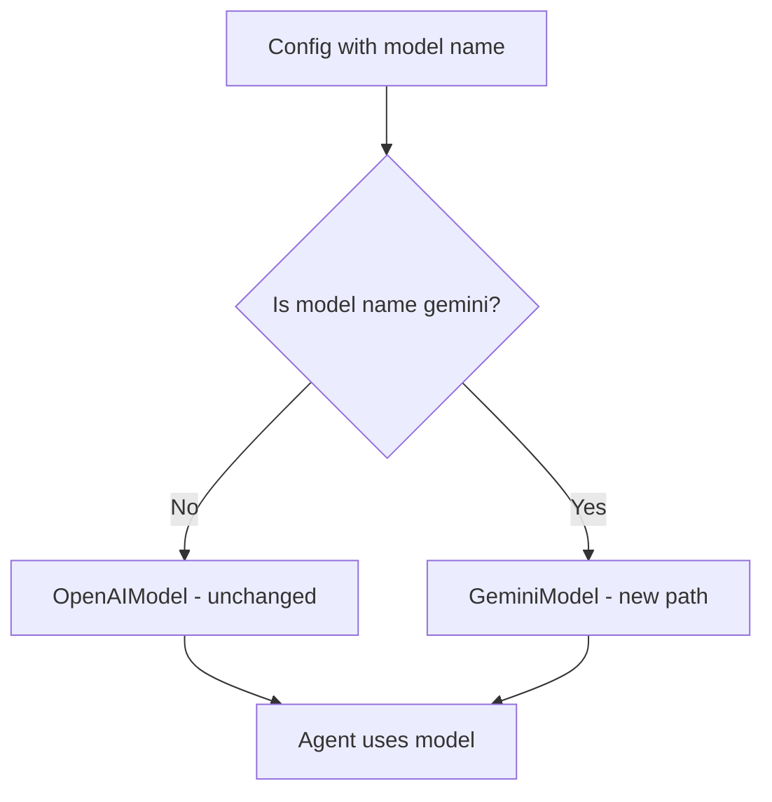

# Add Native Gemini Support Without Breaking OpenAI

## Problem

Gemini's OpenAI-compatible endpoint returns `choices: None` (instead of `[]`), causing pydantic_ai validation errors. Current OpenAI runs must not be affected.

## Solution

Use pydantic_ai's **native Gemini support** (`GeminiModel`) instead of the OpenAI-compatible endpoint. This creates a completely separate code path.




## Changes

### 1. Modify [codewiki/src/be/llm_services.py](codewiki/src/be/llm_services.py)

Add a helper function to detect Gemini models and create the appropriate model type:

```python
# Add import at top
from pydantic_ai.models.gemini import GeminiModel

# Add helper function
def _is_gemini_model(model_name: str) -> bool:
    """Check if model name indicates Gemini."""
    return 'gemini' in model_name.lower()

# Modify create_main_model to branch
def create_main_model(config: Config):
    """Create the main LLM model from configuration."""
    if _is_gemini_model(config.main_model):
        # Use native Gemini support - completely separate path
        return GeminiModel(
            model_name=config.main_model,
            api_key=config.llm_api_key
        )
    
    # UNCHANGED: Existing OpenAI code path
    os.environ['OPENAI_API_KEY'] = config.llm_api_key
    provider = OpenAIProvider(base_url=config.llm_base_url, api_key=config.llm_api_key)
    max_tokens = 16384 if 'gpt-4o' in config.main_model.lower() else 32768
    return OpenAIModel(
        model_name=config.main_model,
        provider=provider,
        settings=OpenAIModelSettings(temperature=0.0, max_tokens=max_tokens)
    )
```

Apply the same pattern to `create_fallback_model`.

### 2. Update `call_llm` function for Gemini

For the simple LLM calls (non-agent), add Gemini branch using the Google Generative AI client:

```python
def call_llm(prompt: str, config: Config, model: str = None, temperature: float = 0.0) -> str:
    if model is None:
        model = config.main_model
    
    if _is_gemini_model(model):
        return _call_gemini_llm(prompt, config, model, temperature)
    
    # UNCHANGED: Existing OpenAI code continues below...
```

Add a new `_call_gemini_llm` function that uses the Google Generative AI client directly.

## Safety Guarantees

1. **Zero changes to OpenAI path** - The `if _is_gemini_model()` check branches BEFORE any OpenAI code executes
2. **Idempotent** - Detection is based purely on model name string matching
3. **No monkey-patching** - No modifications to OpenAI client or pydantic_ai internals
4. **Separate imports** - Gemini imports only loaded when Gemini is used

## Configuration

Users configure Gemini via CLI (already done):

```bash
codewiki config set --api-key "AIza..." --main-model "gemini-2.0-flash"
```