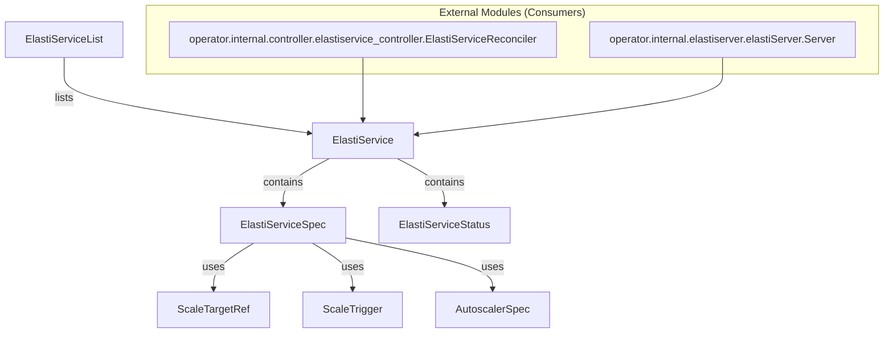

# API Module Documentation

The `api` module defines the core Custom Resource Definitions (CRDs) for the ElastiService operator. These CRDs (`ElastiService`, `ElastiServiceList`) and their associated spec and status types (`ElastiServiceSpec`, `ElastiServiceStatus`) are used to declare, configure, and manage scalable services within a Kubernetes cluster. It provides the schema for users to interact with the ElastiService operator.

## Core Components

### ElastiService (`operator.api.v1alpha1.elastiservice_types.ElastiService`)
The top-level Custom Resource that defines an auto-scalable service. It includes standard Kubernetes metadata and spec/status sub-resources.
- `metav1.TypeMeta`: Kubernetes API version and kind.
- `metav1.ObjectMeta`: Standard Kubernetes object metadata (e.g., name, namespace, labels).
- `Spec`: (Type: [ElastiServiceSpec](#elastiservicespec-operatorapiv1alpha1elastiservice_typeselastiservicespec)) Defines the desired state and configuration for an `ElastiService`.
- `Status`: (Type: [ElastiServiceStatus](#elastiservicestatus-operatorapiv1alpha1elastiservice_typeselastiservicestatus)) Represents the observed status of the `ElastiService` at a given time.

### ElastiServiceSpec (`operator.api.v1alpha1.elastiservice_types.ElastiServiceSpec`)
Defines the desired state and configuration for an `ElastiService`.
- `ScaleTargetRef`: (Type: [ScaleTargetRef](#scaletargetref-operatorapiv1alpha1elastiservice_typesscaletargetref)) References the Kubernetes resource to be scaled (e.g., Deployment, Rollout).
- `Service`: The name of the service to scale.
- `MinTargetReplicas`: Minimum number of replicas to scale to (default: 1, minimum: 1).
- `CooldownPeriod`: Cooldown period in seconds, indicating how long a target resource can be idle before scaling it down (default: 900, minimum: 0, maximum: 604800).
- `Triggers`: (Type: Array of [ScaleTrigger](#scaletrigger-operatorapiv1alpha1elastiservice_typesscaletrigger)) Defines the conditions that trigger scaling actions (minimum 1 item).
- `Autoscaler`: (Type: [AutoscalerSpec](#autoscalerspec-operatorapiv1alpha1elastiservice_typesautoscalerspec), optional) Specifies the autoscaler to be used (e.g., HPA, KEDA).

### AutoscalerSpec (`operator.api.v1alpha1.elastiservice_types.AutoscalerSpec`)
Defines the autoscaler to be used for scaling.
- `Type`: Type of the autoscaler, currently supported values are `hpa` and `keda`.
- `Name`: Name of the autoscaler.

### ElastiServiceStatus (`operator.api.v1alpha1.elastiservice_types.ElastiServiceStatus`)
Represents the observed status of the `ElastiService`.
- `LastReconciledTime`: Last time the ElastiService was reconciled.
- `LastScaledUpTime`: Last time the ElastiService was scaled up.
- `Mode`: Current mode of the ElastiService, either "proxy" (scaled to 0 replicas) or "serve" (scaled to at least 1 replica).

### ElastiServiceList (`operator.api.v1alpha1.elastiservice_types.ElastiServiceList`)
A list of `ElastiService` resources, used for listing multiple ElastiService objects.
- `metav1.TypeMeta`: Kubernetes API version and kind.
- `metav1.ListMeta`: Standard Kubernetes list metadata.
- `Items`: An array of [ElastiService](#elastiservice-operatorapiv1alpha1elastiservice_typeselastiservice) objects.

### ScaleTargetRef (`operator.api.v1alpha1.elastiservice_types.ScaleTargetRef`)
Specifies the target Kubernetes resource to be scaled by the ElastiService operator.
- `APIVersion`: API version of the target resource, currently supported values are `apps/v1` and `argoproj.io/v1alpha1`.
- `Kind`: Kind of the target resource, currently supported values are `deployments`, `rollouts`, `Deployment`, `StatefulSet`, `Rollout`.
- `Name`: Name of the target resource.

### ScaleTrigger (`operator.api.v1alpha1.elastiservice_types.ScaleTrigger`)
Defines a scaling trigger based on external metrics or conditions.
- `Type`: Type of the trigger, currently only `prometheus` is supported.
- `Metadata`: JSON raw message containing trigger-specific metadata (e.g., Prometheus query, server address, threshold, uptime filter). This field is schemaless and preserves unknown fields.

## Architecture and Component Relationships

The `api` module primarily defines data structures that are consumed by other modules within the `operator` package. It serves as the contract for how users and other internal components interact with the ElastiService custom resources.

## How the module fits into the overall system

The `api` module is foundational for the ElastiService operator. It provides the contract for defining and managing auto-scalable services in Kubernetes.
- The `controller` module ([controller.md](controller.md)) utilizes these API types, specifically `ElastiService` and its sub-components, to reconcile the desired state of `ElastiService` resources with the actual state in the Kubernetes cluster. It reads `ElastiService` objects and acts upon their `Spec` to manage the lifecycle and scaling of target resources.
- The `elastiserver` module ([elastiserver.md](elastiserver.md)) might expose an API based on these types or consume them internally for its operations, potentially monitoring and reacting to changes in `ElastiService` resources.
- Users interact directly with the Kubernetes API server, submitting `ElastiService` resources (YAML files conforming to these API types) to configure their scalable applications. This module defines the schema that these YAML files must adhere to.
