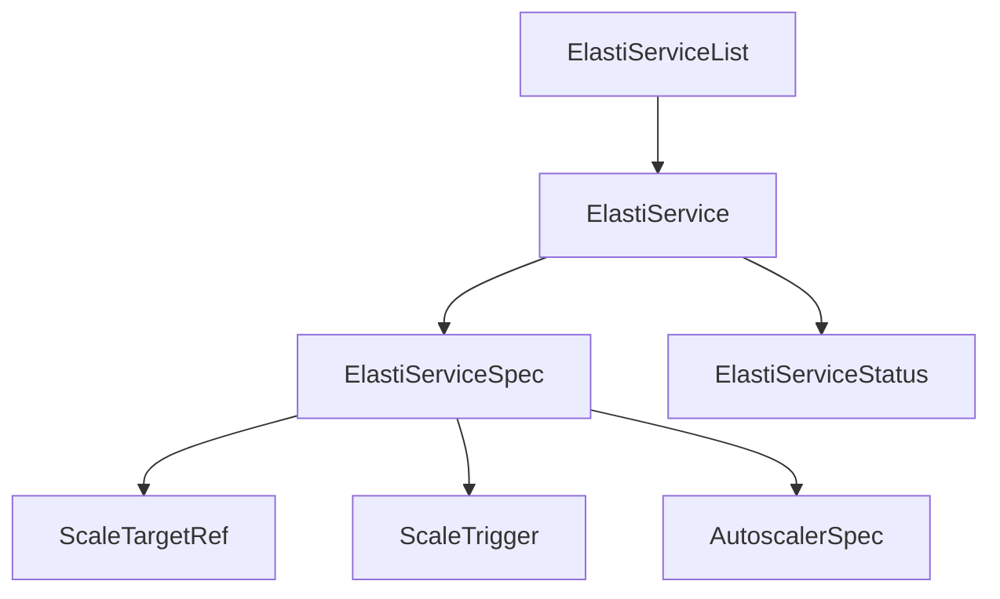

# api_v1alpha1 Module Documentation

## Introduction

The `api_v1alpha1` module defines the Custom Resource Definitions (CRDs) for `ElastiService` resources within the operator. These CRDs enable the definition and management of auto-scalable services in a Kubernetes cluster, allowing users to specify target resources, scaling triggers, and autoscaler configurations. This module provides the Go types that represent the Kubernetes API objects for `ElastiService`.

## Core Functionality and Components

This module consists of several key Go types that define the structure of the `ElastiService` Custom Resource.

### ElastiService

The `ElastiService` is the top-level Custom Resource that encapsulates the desired state (`Spec`) and observed status (`Status`) of an auto-scalable service.

```go
type ElastiService struct {
	metav1.TypeMeta   `json:",inline"`
	metav1.ObjectMeta `json:"metadata,omitempty"`

	Spec   ElastiServiceSpec   `json:"spec,omitempty"`
	Status ElastiServiceStatus `json:"status,omitempty"`
}
```

### ElastiServiceSpec

`ElastiServiceSpec` defines the desired configuration for an `ElastiService`. It specifies how the target resource should be scaled, including minimum replicas, cooldown periods, and scaling triggers.

```go
type ElastiServiceSpec struct {
	ScaleTargetRef ScaleTargetRef `json:"scaleTargetRef"`
	Service string `json:"service"`
	MinTargetReplicas int32 `json:"minTargetReplicas,omitempty" default:"1"`
	CooldownPeriod int32 `json:"cooldownPeriod,omitempty"`
	Triggers   []ScaleTrigger  `json:"triggers,omitempty"`
	Autoscaler *AutoscalerSpec `json:"autoscaler,omitempty"`
}
```

### ScaleTargetRef

`ScaleTargetRef` identifies the specific Kubernetes resource that the `ElastiService` will manage and scale.

```go
type ScaleTargetRef struct {
	APIVersion string `json:"apiVersion"`
	Kind string `json:"kind"`
	Name string `json:"name"`
}
```

### ScaleTrigger

`ScaleTrigger` defines the conditions or metrics that will initiate a scaling event for the target resource. Currently, it supports Prometheus-based triggers.

```go
type ScaleTrigger struct {
	Type string `json:"type"`
	Metadata json.RawMessage `json:"metadata,omitempty"`
}
```

### AutoscalerSpec

`AutoscalerSpec` specifies which autoscaling mechanism should be used to scale the target resource, such as Horizontal Pod Autoscaler (HPA) or KEDA.

```go
type AutoscalerSpec struct {
	Type string `json:"type"`
	Name string `json:"name"`
}
```

### ElastiServiceStatus

`ElastiServiceStatus` represents the current observed state of the `ElastiService` resource, including reconciliation timestamps and the current operating mode.

```go
type ElastiServiceStatus struct {
	LastReconciledTime metav1.Time `json:"lastReconciledTime,omitempty"`
	LastScaledUpTime *metav1.Time `json:"lastScaledUpTime,omitempty"`
	Mode string `json:"mode,omitempty"`
}
```

### ElastiServiceList

`ElastiServiceList` is a standard Kubernetes list type used to hold a collection of `ElastiService` resources.

```go
type ElastiServiceList struct {
	metav1.TypeMeta `json:",inline"`
	metav1.ListMeta `json:"metadata,omitempty"`
	Items           []ElastiService `json:"items"`
}
```

## Architecture and Component Relationships

The following diagram illustrates the relationships between the core components of the `api_v1alpha1` module.



## How the Module Fits into the Overall System

The `api_v1alpha1` module defines the foundational API for the `operator` module. The `operator.internal.controller.elastiservice_controller.ElastiServiceReconciler` component (detailed in [operator.md](operator.md)) watches for `ElastiService` resources created based on these definitions.

When an `ElastiService` object is created or updated, the `ElastiServiceReconciler` reads its `ElastiServiceSpec` to understand:
- Which `ScaleTargetRef` (e.g., Deployment, Rollout) needs to be scaled.
- The `ScaleTrigger` conditions (e.g., Prometheus metrics) that should initiate scaling actions.
- The desired `MinTargetReplicas` and `CooldownPeriod`.
- The `AutoscalerSpec` indicating the preferred autoscaling mechanism.

The reconciler then interacts with Kubernetes APIs and potentially external systems (like Prometheus) to achieve the desired state defined in the `ElastiServiceSpec`. The `ElastiServiceStatus` is updated to reflect the current state and operational mode of the service.

Other modules, such as `pkg.scaling.scale_handler.ScaleHandler` (detailed in [pkg.md](pkg.md)), would likely consume these API definitions to implement the actual scaling logic based on the `ScaleTrigger` and `AutoscalerSpec`. The `resolver` module might also interact with the information provided by these CRDs for routing or service discovery, although its direct interaction with these specific types isn't immediately apparent from the provided component names.