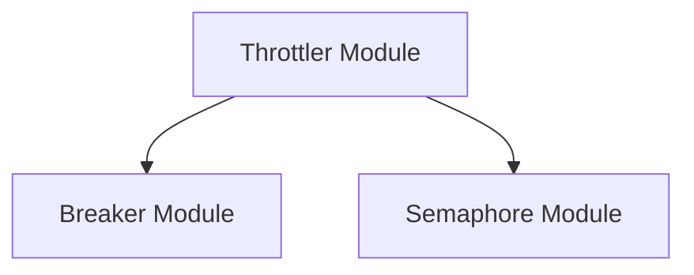

# Breaker Module

## Introduction

The `breaker` module is a critical component within the `resolver` system, specifically residing under the `throttler` module. Its primary purpose is to implement a circuit breaker pattern, a design pattern used to detect failures and encapsulate the logic of preventing a system from repeatedly trying to execute an operation that is likely to fail. This helps in maintaining system stability and resilience by preventing cascading failures and providing graceful degradation.

The module focuses on controlling the flow of requests and protecting downstream services from being overwhelmed, ensuring that the `resolver` can operate reliably under varying load conditions.

## Architecture

The `breaker` module works in conjunction with the `semaphore` module to manage concurrency and protect resources. It is configured with specific parameters to determine its behavior regarding request queuing, maximum concurrent operations, and initial capacity.

### Architecture Diagram

## Core Functionality

The `breaker` module provides the core logic for the circuit breaker pattern. It manages the number of in-flight requests and, in collaboration with a semaphore, decides whether to allow new requests or trip the circuit to protect the system.

### Components:

-   **`BreakerParams`**: Defines the configuration parameters for the circuit breaker, such as queue depth, maximum concurrency, and initial capacity.
-   **`Breaker`**: The main circuit breaker implementation, responsible for tracking in-flight requests, using a semaphore to limit concurrency, and deciding when to open or close the circuit.

## Integration with other modules

The `breaker` module is tightly integrated with the `throttler` module, which orchestrates the overall request throttling and concurrency management. It relies on the `semaphore` module for low-level concurrency control.
