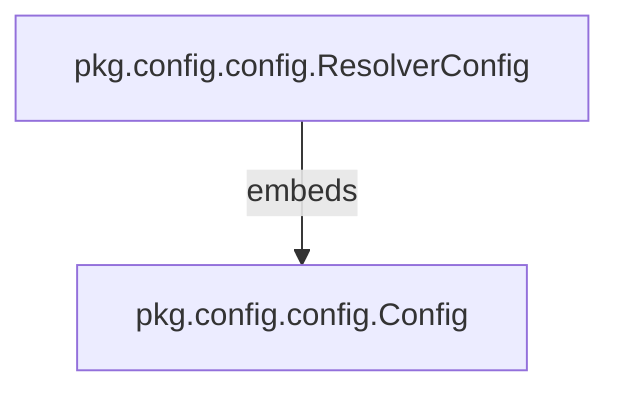

# Config Module Documentation

## Introduction

The `config` module (`pkg.config.config`) is a foundational package responsible for defining the core configuration structures used throughout the system. It provides a standardized way to manage and access essential parameters for various components, especially those interacting with Kubernetes resources and network services.

## Core Functionality

This module primarily defines two key configuration structures:

1.  **`Config`**: A generic configuration struct that encapsulates common parameters such as Kubernetes namespace, deployment name, service name, and port. This struct serves as a base for more specialized configurations.
2.  **`ResolverConfig`**: An extension of the `Config` struct, adding a specific parameter for the reverse proxy port. This specialized configuration is tailored for components that function as a reverse proxy, such as those within the `resolver` module.


### `pkg.config.config.Config`

```go
type Config struct {
        Namespace      string
        DeploymentName string
        ServiceName    string
        Port           int32
}
```


### `pkg.config.config.ResolverConfig`

```go
type ResolverConfig struct {
        Config

        ReverseProxyPort int32
}
```

## Architecture and Component Relationships

The `config` module's architecture is straightforward, focusing on data structure definitions. The relationship between its core components is one of inheritance or embedding, where `ResolverConfig` extends the `Config` struct.



## How the Module Fits into the Overall System

The `config` module serves as a central repository for system-wide configuration definitions.

*   **`Config`**: This base configuration is likely utilized by various modules that need to identify and interact with Kubernetes resources (e.g., `pkg.k8shelper.ops.Ops` for Kubernetes operations) or define their service endpoints.
*   **`ResolverConfig`**: This specialized configuration is specifically designed for the `resolver` module. Components within the `resolver` module, such as `resolver.cmd.main.config`, would use `ResolverConfig` to set up their operational parameters, including the reverse proxy port. This ensures that the resolver operates with the correct network and Kubernetes environment settings.

By centralizing configuration definitions, the `config` module promotes consistency, reduces redundancy, and simplifies the management of system parameters across different components. Other modules can import and utilize these structures, linking back to this documentation for details on configuration parameters.
