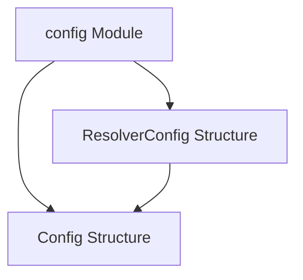

# Config Module Documentation

## Introduction and Purpose

The `config` module, located within the `pkg` directory, is responsible for defining the core configuration structures used throughout the system. It provides essential parameters for deploying and operating services, specifically detailing network configurations and service identification within a Kubernetes environment.

## Architecture Overview

The `config` module is a fundamental building block that defines data structures. It doesn't have a complex internal architecture with multiple sub-modules or intricate relationships. Instead, it offers simple, clear data types that are consumed by other modules, such as `operator` and `resolver`, to initialize their operations.

The `ResolverConfig` directly embeds the `Config` structure, indicating that a resolver's configuration extends the basic service configuration with additional resolver-specific parameters.

## Core Components and Functionality

### `Config`

The `Config` struct defines the fundamental configuration parameters for a service or deployment. It includes details necessary for identifying and addressing a service within a Kubernetes cluster.

-   **`Namespace`**: (string) The Kubernetes namespace where the service is deployed.
-   **`DeploymentName`**: (string) The name of the Kubernetes deployment associated with the service.
-   **`ServiceName`**: (string) The name of the Kubernetes service itself.
-   **`Port`**: (int32) The port number on which the service is exposed.

### `ResolverConfig`

The `ResolverConfig` struct extends the `Config` struct with additional parameters specific to a resolver component. It inherits all fields from `Config` and adds a port for the reverse proxy functionality.

-   **`Config`**: (embedded struct) Inherits all fields from the `Config` struct (Namespace, DeploymentName, ServiceName, Port).
-   **`ReverseProxyPort`**: (int32) The port number used by the reverse proxy within the resolver component.

