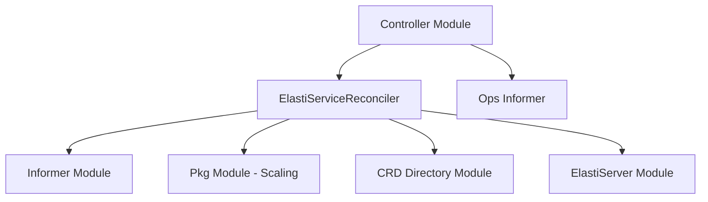

# Controller Module Documentation

## Introduction
The `controller` module is a crucial component within the operator, primarily responsible for managing the lifecycle and reconciliation of `ElastiService` custom resources in a Kubernetes cluster. It ensures that the actual state of the cluster matches the desired state defined by `ElastiService` objects.

## Architecture Overview
The `controller` module houses the core reconciliation logic for ElastiService resources. It interacts with various other modules and Kubernetes components to perform its duties, including informing, scaling, and managing CRD definitions.

## High-Level Functionality

### ElastiService Reconciler
The `elastiservice_controller.ElastiServiceReconciler` is the core component responsible for watching `ElastiService` resources and reacting to changes (creation, updates, deletions). It orchestrates the necessary actions, such as interacting with the Kubernetes API, managing informers, and invoking scaling operations.
[More details in elastiservice_controller.md](elastiservice_controller.md)

### Ops Informer
The `ops_informer` sub-module contains structures and logic related to updating object information, specifically `updateObjInfo`, which helps in maintaining the current state and desired state of resources for reconciliation.
[More details in ops_informer.md](ops_informer.md)

## Relationships with other Modules

*   **Informer Module**: The `controller` relies on the [informer module](informer.md) to receive events about changes to Kubernetes resources, enabling it to reconcile `ElastiService` objects efficiently.
*   **Pkg Module (Scaling)**: The `controller` utilizes components from the [pkg module](pkg.md), particularly the `ScaleHandler`, to implement the scaling logic for `ElastiService` resources.
*   **CRD Directory Module**: The `controller` might interact with the [crddirectory module](crddirectory.md) to retrieve information about Custom Resource Definitions, ensuring proper handling of `ElastiService` CRDs.
*   **ElastiServer Module**: The `controller` collaborates with the [elastiserver module](elastiserver.md) to manage the underlying ElastiService instances based on the reconciliation logic.
