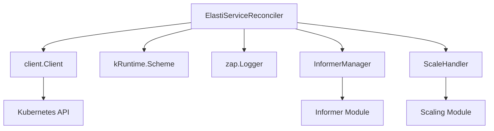

# Controller Module Documentation

## Introduction

The `controller` module, located within `operator/internal/controller`, is a critical component of the operator responsible for reconciling `ElastiService` custom resources. It acts as the brain of the operator, observing changes in the Kubernetes cluster related to `ElastiService` objects and taking appropriate actions to ensure the desired state matches the actual state. This module orchestrates scaling operations, manages informers, and maintains the lifecycle of `ElastiService` instances.

## Core Functionality

### ElastiServiceReconciler

The `ElastiServiceReconciler` is the primary component within this module, implementing the `Reconciler` interface from `controller-runtime`. Its main responsibilities include:

*   **Reconciling ElastiService Resources**: Watches for create, update, and delete events for `ElastiService` custom resources and triggers reconciliation loops.
*   **Managing Scaling Operations**: Interacts with the `ScaleHandler` to initiate scaling up or down of associated workloads based on the `ElastiService`'s scaling policies.
*   **Informer Management**: Utilizes an `InformerManager` to set up and manage informers for various Kubernetes resources, allowing the controller to efficiently track changes.
*   **State Management**: Uses `SwitchModeLocks`, `InformerStartLocks`, and `ReconcileLocks` to handle concurrent operations and prevent race conditions during reconciliation and mode switching.
*   **Logging**: Employs a `zap.Logger` for structured logging, providing insights into the reconciliation process.

### updateObjInfo

The `updateObjInfo` struct is a data container used to hold relevant information about an object during updates or reconciliation. It encapsulates key details necessary for processing changes, such as:

*   `specReplicas`: The number of replicas desired in the specification.
*   `statusReplicas`: The current number of replicas reported in the status.
*   `selector`: A map of labels used to select associated pods or resources.
*   `namespace`: The namespace of the object.
*   `name`: The name of the object.

## Architecture and Component Relationships

The `ElastiServiceReconciler` is at the heart of the controller's operations, interacting with several key components and modules:

*   **`client.Client`**: Used for interacting with the Kubernetes API server, performing operations like fetching, creating, updating, and deleting Kubernetes resources.
*   **`kRuntime.Scheme`**: Provides a way to register Kubernetes API types, allowing the controller to work with different versions and kinds of resources.
*   **`zap.Logger`**: An efficient, structured logging library used throughout the reconciler for operational insights and debugging.
*   **`InformerManager`**: Manages the lifecycle of informers. It's responsible for starting, stopping, and providing access to cached objects (see [Informer Module](informer.md)).
*   **`ScaleHandler`**: Orchestrates the actual scaling logic, interacting with various scalers to adjust the number of replicas for a workload (see [Scaling Module](scaling.md)).

## System Integration

The `controller` module is an integral part of the `operator` module, specifically designed to manage `ElastiService` custom resources within a Kubernetes cluster. It fits into the overall system as follows:

1.  **Custom Resource Definition (CRD) Management**: The `operator` defines the `ElastiService` CRD, which the controller watches.
2.  **Event-Driven Reconciliation**: When an `ElastiService` object is created, updated, or deleted, the Kubernetes API server notifies the `ElastiServiceReconciler`.
3.  **Orchestration of Scaling**: The reconciler, upon detecting changes or desired state mismatches, delegates scaling decisions and actions to the `ScaleHandler`.
4.  **Resource Monitoring**: Through the `InformerManager` and its underlying informers, the controller continuously monitors the state of relevant Kubernetes resources (e.g., deployments, statefulsets) and `ElastiService` objects themselves.
5.  **Feedback Loop**: The controller updates the `status` field of the `ElastiService` resource to reflect the current state of the managed workload, providing a feedback mechanism to users and other components.

In essence, the `controller` module is the active agent that bridges the declarative API of Kubernetes with the operational logic required to manage dynamic scaling for services defined by `ElastiService` resources.