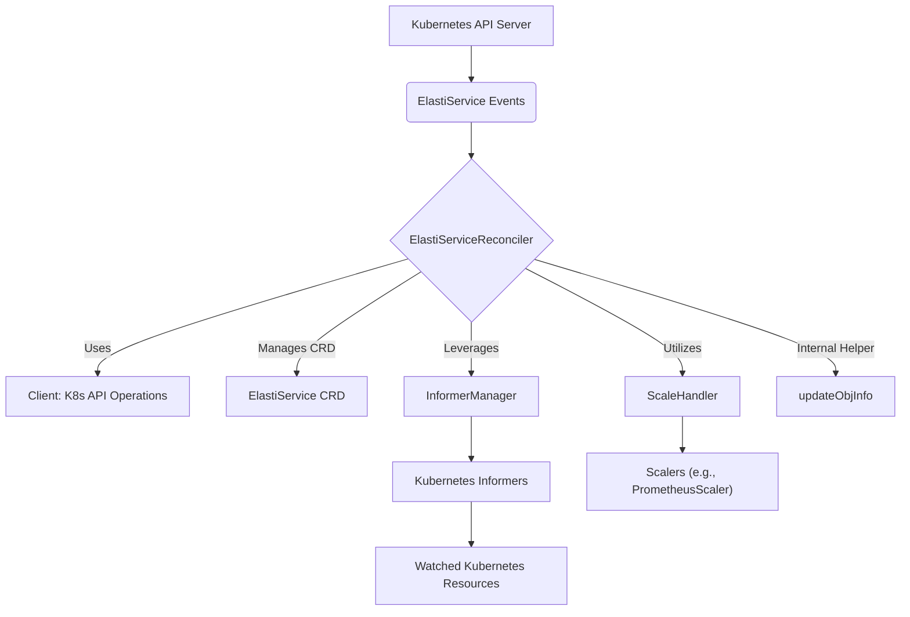

# Controller Module Documentation

## Introduction

The `controller` module in the `operator` package is a crucial component responsible for reconciling `ElastiService` custom resources within a Kubernetes cluster. It observes changes in `ElastiService` objects and their dependent resources, then takes necessary actions to align the actual state of the system with the desired state defined in the `ElastiService` specification. This module leverages Kubernetes informers for efficient change detection and integrates with a scaling handler to manage the dynamic scaling of target resources.

## Core Components

### 1. `ElastiServiceReconciler`

The `ElastiServiceReconciler` is the heart of the `controller` module. It implements the `Reconciler` interface for the `ElastiService` custom resource, ensuring its lifecycle management and desired state enforcement. Its primary function involves continuously watching for `ElastiService` resource events (create, update, delete) and orchestrating the necessary actions to bring the cluster's state into alignment with the `ElastiService` definition.

**Key Fields and Dependencies:**

*   **`client.Client`**: A Kubernetes API client used for performing CRUD (Create, Read, Update, Delete) operations on Kubernetes resources within the cluster.
*   **`Scheme`**: An instance of `*kRuntime.Scheme` that provides a mapping between Kubernetes API group/version/kind and Go types, facilitating object serialization and deserialization.
*   **`Logger`**: A `*zap.Logger` instance for structured logging of events, errors, and debugging information throughout the reconciliation process.
*   **`InformerManager`**: An instance of `informer.Manager` responsible for managing Kubernetes informers. This component is essential for efficiently watching Kubernetes resources and receiving event notifications. For a deeper understanding, refer to the [informer documentation](informer.md).
*   **`SwitchModeLocks`, `InformerStartLocks`, `ReconcileLocks`**: These are `sync.Map` instances used for robust concurrency control. They ensure that critical operations such as switching modes for an `ElastiService`, starting informers for specific resources, or reconciling a particular `ElastiService` instance are properly synchronized. This prevents race conditions and maintains data integrity in a multi-threaded environment.
*   **`ScaleHandler`**: An instance of `scaling.ScaleHandler` (from the `pkg` module) responsible for executing scaling operations based on the `ElastiService` configuration. This component interacts with various scalers to dynamically adjust the replica count of target resources. For more details, refer to the [pkg documentation](pkg.md).

**Reconciliation Workflow:**

The `ElastiServiceReconciler` follows a standard Kubernetes reconciliation loop:
1.  **Event Detection**: Watches for changes in `ElastiService` custom resources and their associated Kubernetes objects.
2.  **Resource Fetching**: Retrieves the latest state of the `ElastiService` and any dependent resources (e.g., Deployments, StatefulSets).
3.  **State Comparison**: Compares the current actual state with the desired state defined in the `ElastiService`'s `spec`.
4.  **Action Execution**: Performs necessary operations to achieve the desired state, which may include:
    *   Creating, updating, or deleting underlying Kubernetes resources.
    *   Configuring and managing autoscaling logic based on `AutoscalerSpec` and `ScaleTrigger` definitions in the `ElastiService`.
    *   Updating the `ElastiServiceStatus` to reflect the current operational state and any encountered conditions.

### 2. `updateObjInfo`

The `updateObjInfo` struct is an internal helper component used within the `controller` module, primarily during the reconciliation process. It serves to encapsulate and temporarily hold relevant information about a Kubernetes object when it's being updated or processed. This struct simplifies the passing of key object details between different functions or stages of the reconciliation, particularly when dealing with scaling decisions or status updates.

**Fields:**

*   **`specReplicas`**: The desired number of replicas as specified in the object's `.spec`.
*   **`statusReplicas`**: The current number of replicas as reported in the object's `.status`.
*   **`selector`**: A map of labels typically used to select associated pods or other child resources.
*   **`namespace`**: The Kubernetes namespace where the object resides.
*   **`name`**: The name of the Kubernetes object.

## Architecture and Component Relationships

The following diagram illustrates the high-level architecture of the `controller` module and its interactions with other components within the `operator` system and the broader Kubernetes environment.

