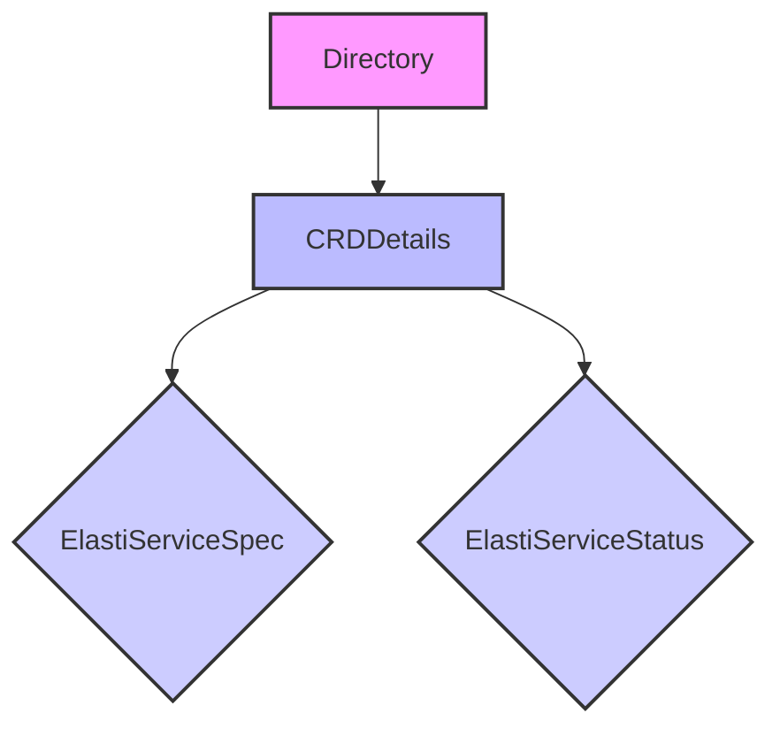

# CRD Directory Module

## Introduction

The `crddirectory` module serves as a central repository for managing Custom Resource Definition (CRD) details within the operator. Specifically, it focuses on storing and providing access to information about `ElastiService` resources, including their specifications and statuses. This module is crucial for maintaining an up-to-date view of the deployed custom resources, enabling other components, such as controllers and informers, to efficiently retrieve and process CRD-related data.

## Architecture and Component Relationships

The `crddirectory` module consists of two primary components: `Directory` and `CRDDetails`. The `Directory` acts as a concurrent-safe storage mechanism for multiple `CRDDetails` objects, each representing a specific `ElastiService` instance.

### `Directory`

The `Directory` component (`operator.internal.crddirectory.directory.Directory`) is responsible for maintaining a collection of `ElastiService` CRD details. It uses a `sync.Map` to ensure thread-safe access and manipulation of these details across different goroutines, which is essential in a concurrent environment like a Kubernetes operator.

**Core Fields:**
- `Services` (`sync.Map`): A concurrent map used to store `CRDDetails` objects, indexed by a unique identifier (likely the CRD's name or a combination of namespace and name).
- `Logger` (`*zap.Logger`): An instance of a Zap logger for structured, leveled logging within the directory operations.

### `CRDDetails`

The `CRDDetails` component (`operator.internal.crddirectory.directory.CRDDetails`) encapsulates the essential information about a single `ElastiService` custom resource. It provides a structured way to hold the name, specification, and current status of an `ElastiService`.

**Core Fields:**
- `CRDName` (`string`): The name of the `ElastiService` custom resource.
- `Spec` (`v1alpha1.ElastiServiceSpec`): The desired specification of the `ElastiService`. This field is a direct reference to the `ElastiServiceSpec` type defined in the `api_v1alpha1` module. For more details, refer to the [api_v1alpha1 module documentation](api_v1alpha1.md).
- `Status` (`v1alpha1.ElastiServiceStatus`): The current observed status of the `ElastiService`. This field refers to the `ElastiServiceStatus` type from the `api_v1alpha1` module. For more details, refer to the [api_v1alpha1 module documentation](api_v1alpha1.md).

## How the Module Fits into the Overall System

The `crddirectory` module is a foundational component within the `operator` system, acting as a reliable source of truth for `ElastiService` CRD information. It is leveraged by several other modules:

- **`controller` module**: The `ElastiServiceReconciler` within the `controller` module likely interacts with the `Directory` to retrieve `CRDDetails` for reconciliation loops. When an `ElastiService` is created, updated, or deleted, the controller would update the `Directory` accordingly. For more details, refer to the [controller module documentation](controller.md).
- **`informer` module**: The `informer` module, which watches for changes in Kubernetes resources, would populate and update the `Directory` with the latest `CRDDetails` as events occur. This ensures that the `Directory` always reflects the current state of `ElastiService` resources in the cluster. For more details, refer to the [informer module documentation](informer.md).
- **`api_v1alpha1` module**: Provides the fundamental `ElastiServiceSpec` and `ElastiServiceStatus` types that `CRDDetails` utilizes. This module defines the structure and schema for the custom resources managed by the operator. For more details, refer to the [api_v1alpha1 module documentation](api_v1alpha1.md).

By centralizing CRD management, the `crddirectory` module ensures data consistency and provides a clear separation of concerns, making the operator more robust and maintainable.