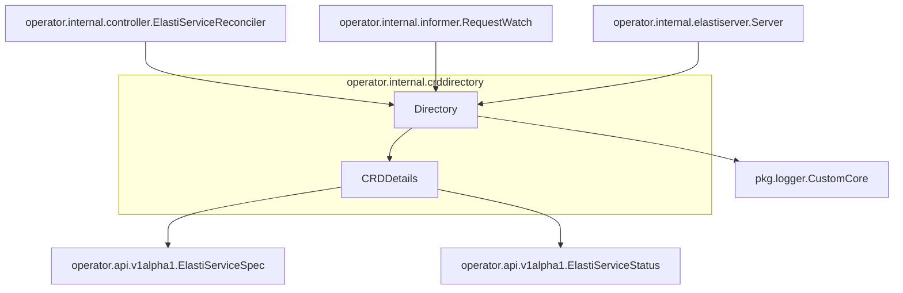

# crddirectory

The `crddirectory` module is responsible for maintaining an in-memory directory of `ElastiService` Custom Resource Definitions (CRDs) and their associated details within the operator. It acts as a central registry for `ElastiService` instances, providing a consistent view of their specifications and statuses for various components of the operator.

## Core Components

### `Directory`

The `Directory` struct serves as the main entry point for managing the collection of `ElastiService` CRD details. It uses a `sync.Map` for efficient and concurrent storage and retrieval of service information.

```go
type Directory struct {
	Services sync.Map
	Logger   *zap.Logger
}
```

*   **`Services`**: A `sync.Map` that stores key-value pairs, where keys are likely the names of `ElastiService` CRDs and values are their corresponding `CRDDetails`. This ensures thread-safe access to the service directory.
*   **`Logger`**: A `*zap.Logger` instance used for logging operations within the directory, providing insights into its activities and potential issues. This component integrates with the [logger module](logger.md) for standardized logging.

### `CRDDetails`

The `CRDDetails` struct encapsulates the essential information for a single `ElastiService` Custom Resource.

```go
type CRDDetails struct {
	CRDName string
	Spec    v1alpha1.ElastiServiceSpec
	Status  v1alpha1.ElastiServiceStatus
}
```

*   **`CRDName`**: A string representing the unique name of the `ElastiService` CRD.
*   **`Spec`**: Contains the desired state specification of the `ElastiService` as defined by `v1alpha1.ElastiServiceSpec`. This structure is defined in the [api module](api.md).
*   **`Status`**: Holds the current observed status of the `ElastiService` as defined by `v1alpha1.ElastiServiceStatus`. This structure is also defined in the [api module](api.md).

## Architecture and Component Relationships

The `crddirectory` module, primarily through its `Directory` component, acts as a central data store for `ElastiService` CRD information. It interacts with several other modules to fulfill its role.



*   **`Directory`**: Stores and manages `CRDDetails` objects. It utilizes `pkg.logger.CustomCore` for logging internal operations.
*   **`CRDDetails`**: Encapsulates the `Spec` and `Status` of an `ElastiService`, which are defined in the `operator.api` module.
*   **`operator.internal.controller.ElastiServiceReconciler`**: The reconciler uses the `Directory` to fetch and update `ElastiService` CRD information during reconciliation loops.
*   **`operator.internal.informer.RequestWatch`**: The informer populates and updates the `Directory` with the latest `ElastiService` CRD data from the Kubernetes API server.
*   **`operator.internal.elastiserver.Server`**: This server component might query the `Directory` to expose information about the managed `ElastiService` instances.

## How the Module Fits into the Overall System

The `crddirectory` module is a critical internal component of the operator, acting as the single source of truth for the current state of `ElastiService` Custom Resources. It decouples the various components that need access to CRD data from directly interacting with the Kubernetes API or complex caching mechanisms.

By providing a synchronized and readily available directory, `crddirectory` enables:
*   **Efficient Reconciliation**: The controller can quickly access CRD specifications and statuses without repeatedly querying the API server.
*   **Real-time Updates**: The informer ensures the directory is always up-to-date with the latest changes in the Kubernetes cluster.
*   **Centralized Data Access**: Other operator components can consistently retrieve `ElastiService` information from a single, well-defined interface.

This module is fundamental for the operator's ability to manage and respond to changes in `ElastiService` resources effectively.