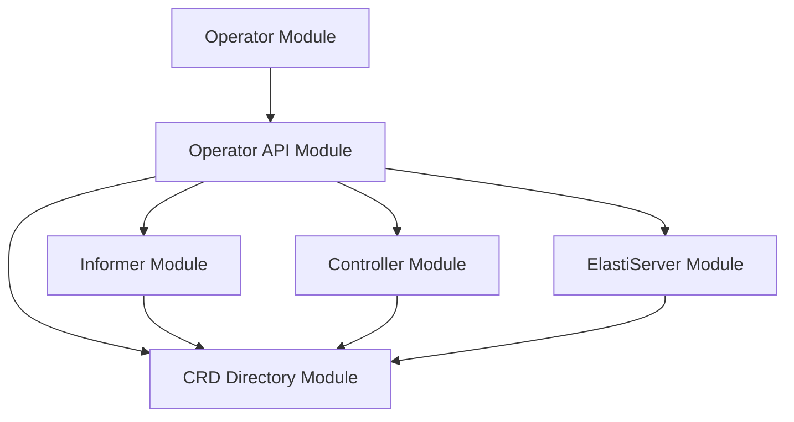

# CRD Directory Module Documentation

## 1. Introduction and Purpose

The `crddirectory` module serves as a central registry and cache for Custom Resource Definitions (CRDs) within the `operator`. Specifically, it manages the details of `ElastiService` CRDs, including their specifications and current statuses. This module provides a concurrency-safe mechanism to store and retrieve CRD information, ensuring that other components of the operator, such as controllers and informers, have consistent and up-to-date access to these critical resources.

Its primary purpose is to abstract away the direct interaction with Kubernetes API for fetching CRD details by maintaining an in-memory representation, thereby improving performance and simplifying CRD management logic for the rest of the operator.

## 2. Architecture Overview

The `crddirectory` module is an integral part of the `operator`'s internal structure, residing under the `operator_api` layer. It interacts closely with other core components of the operator to maintain a consistent view of the `ElastiService` CRDs deployed in the Kubernetes cluster.

Here's an architectural diagram illustrating its position and relationships:

### Component Relationships:

*   **`operator_api`**: `crddirectory` directly consumes types defined in `operator_api` (e.g., `ElastiServiceSpec`, `ElastiServiceStatus`) to store CRD details.
*   **`Informer`**: The `informer` module is responsible for watching changes in Kubernetes resources. It pushes updates to the `crddirectory` to keep its cache current whenever an `ElastiService` CRD is created, updated, or deleted.
*   **`Controller`**: The `controller` module (specifically the `ElastiServiceReconciler`) relies on the `crddirectory` to fetch the latest state of `ElastiService` CRDs during reconciliation cycles. It might also update the status of CRDs stored in the directory.
*   **`ElastiServer`**: The `elastiserver` module, which handles API requests, might query the `crddirectory` to retrieve CRD-related information to serve client requests or perform other operational tasks.

## 3. Core Functionality and Components

The `crddirectory` module consists of two primary components: `CRDDetails` and `Directory`.

### 3.1 `CRDDetails`

**Description**:
The `CRDDetails` struct encapsulates the essential information about a single `ElastiService` Custom Resource Definition. It provides a structured way to store the CRD's name, its desired specification, and its current operational status.

**Core Components**:
*   `CRDName string`: A string identifier for the Custom Resource Definition, typically its name within Kubernetes.
*   `Spec v1alpha1.ElastiServiceSpec`: Represents the desired state or configuration of the `ElastiService` CRD, as defined by the operator's API (`operator.api.v1alpha1.elastiservice_types.ElastiServiceSpec`). This includes parameters like scaling policies, target references, and autoscaler specifications. For more details, refer to the [operator_api.md](operator_api.md) documentation.
*   `Status v1alpha1.ElastiServiceStatus`: Reflects the current operational status and observed state of the `ElastiService` CRD, also defined in the operator's API (`operator.api.v1alpha1.elastiservice_types.ElastiServiceStatus`). This might include conditions, observed generations, or replica counts. For more details, refer to the [operator_api.md](operator_api.md) documentation.

### 3.2 `Directory`

**Description**:
The `Directory` struct acts as the central repository or cache for all `ElastiService` CRDs managed by the operator. It provides a concurrency-safe map to store `CRDDetails` objects, allowing multiple goroutines (e.g., from informers or controllers) to access and modify CRD information without conflicts.

**Core Components**:
*   `Services sync.Map`: A `sync.Map` instance used to store `CRDDetails` objects. This map is designed for concurrent use by multiple goroutines without explicit locking, making it suitable for high-concurrency environments. It typically maps a unique identifier (e.g., `CRDName`) to its corresponding `CRDDetails` object.
*   `Logger *zap.Logger`: A structured logger instance (from the `zap` logging library) used for logging internal operations, debugging information, and errors within the `Directory` module. This helps in monitoring and troubleshooting the CRD caching mechanism.
