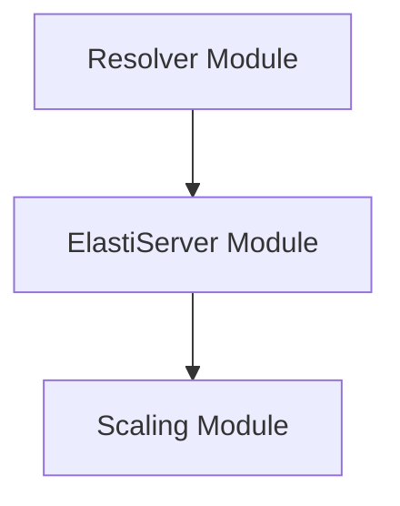

# ElastiServer Module Documentation

## Introduction

The `elastiserver` module, specifically the `Server` component, acts as a communication hub within the system, primarily responsible for receiving events and triggering scaling actions. It facilitates the dynamic scaling of services in response to incoming requests, working in conjunction with the `resolver` and `scaling` modules.

## Core Functionality

The `elastiserver` module's core functionality revolves around the `Server` component, which is designed to:

*   **Receive Communications**: It listens for events, particularly from the `resolver` module, indicating when a service receives a request. This mechanism allows the `elastiserver` to be aware of service demand.
*   **Trigger Scaling Operations**: Upon receiving relevant events, the `Server` component utilizes a `ScaleHandler` to initiate scaling actions. For instance, if a service with 0 replicas receives a request, the `elastiserver` will trigger a scale-up operation.
*   **Manage Rescaling Duration**: It incorporates a configurable `rescaleDuration` to control the frequency or timing of scaling checks, preventing over-frequent scaling adjustments.

### `Server` Component Details

The `operator.internal.elastiserver.elastiServer.Server` struct is defined as follows:

```go
type (
	Response struct {
		Message string `json:"message"`
	}

	// Server is used to receive communication from Resolver, or any future components
	// It is used by components about certain events, like when resolver receive the request
	// for a service, that service is scaled up if it's at 0 replicas
	Server struct {
		logger       *zap.Logger
		scaleHandler *scaling.ScaleHandler
		// rescaleDuration is the duration to wait before checking to rescaling the target
		rescaleDuration time.Duration
	}
)
```

**Fields:**

*   `logger (*zap.Logger)`: An instance of a Zap logger for structured logging within the `Server` component, enabling detailed tracing and debugging of operations.
*   `scaleHandler (*scaling.ScaleHandler)`: A pointer to a `ScaleHandler` instance. This dependency is critical as it provides the interface for interacting with the `scaling` module to perform actual scaling operations on targeted services. For more details, refer to the [scaling module documentation](scaling.md).
*   `rescaleDuration (time.Duration)`: A duration value that specifies the waiting period before the system checks for potential rescaling of a target service. This helps in debouncing scaling actions.

## Architecture and System Integration

The `elastiserver` module plays a pivotal role in the overall system by bridging the `resolver`'s request handling with the `scaling` capabilities.



### Component Relationships:

*   **`Resolver Module` to `ElastiServer Module`**: The `resolver` module, responsible for handling incoming requests and routing, communicates with the `elastiserver` module. This communication informs `elastiserver` about events like a service receiving a new request, which can then trigger scaling logic.
*   **`ElastiServer Module` to `Scaling Module`**: The `elastiserver` module depends on the `scaling` module (specifically `pkg.scaling.scale_handler.ScaleHandler`) to execute scaling operations. When `elastiserver` determines that a service needs to be scaled up or down, it delegates this task to the `ScaleHandler` provided by the `scaling` module.

This integration ensures that the system can dynamically adjust service replicas based on demand, improving resource utilization and responsiveness. The `elastiserver` acts as an intelligent intermediary, translating observed events into concrete scaling actions through its interaction with the `scaling` component.