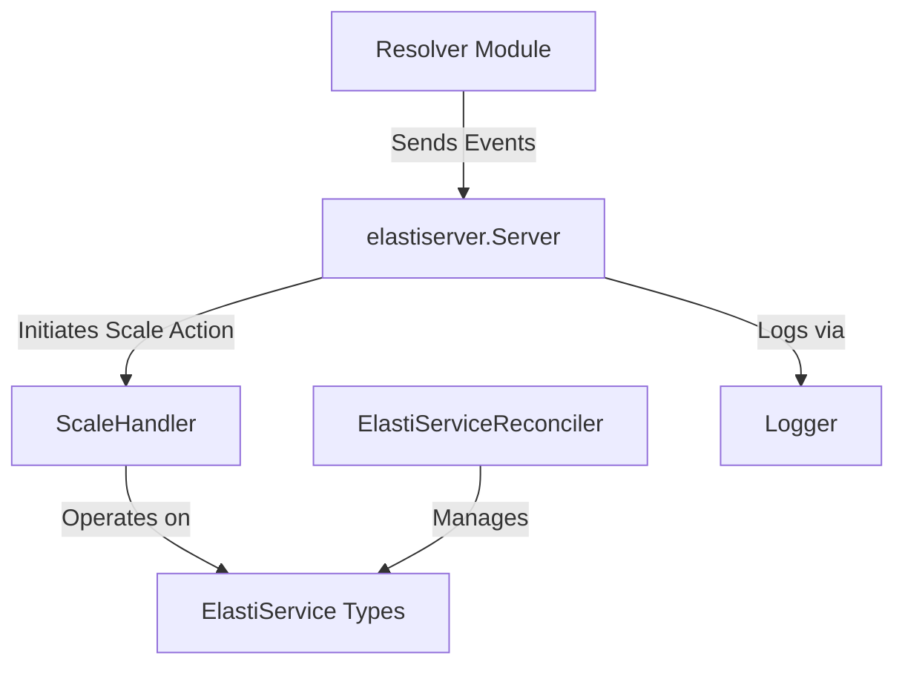

# ElastiServer Module Documentation

## Introduction

The `elastiserver` module provides the core server component (`Server`) responsible for receiving and processing external communication, primarily from the `Resolver` module. Its main function is to trigger scaling actions for services based on these communications, especially when a service at zero replicas receives a request.

## Core Components

### `operator.internal.elastiserver.elastiServer.Server`

This is the central component of the `elastiserver` module. It acts as an RPC server, listening for events and requests from other components, such as the `Resolver`. When a relevant event occurs (e.g., a request for a service currently scaled to zero replicas), the `Server` initiates the necessary scaling procedures.

**Fields:**

*   `logger`: A `zap.Logger` instance used for logging messages and events within the server.
*   `scaleHandler`: A pointer to a `scaling.ScaleHandler` instance. This component is responsible for executing the actual scaling operations by interacting with the underlying Kubernetes API.
*   `rescaleDuration`: A `time.Duration` specifying the duration to wait before re-evaluating and potentially rescaling a target service.

### `operator.internal.elastiserver.elastiServer.Response`

A simple struct used to define the response format for communications received by the `Server`. It currently contains a `Message` field of type string.

```go
type (
        Response struct {
                Message string `json:"message"`
        }

        // Server is used to receive communication from Resolver, or any future components
        // It is used by components about certain events, like when resolver receive the request
        // for a service, that service is scaled up if it's at 0 replicas
        Server struct {
                logger       *zap.Logger
                scaleHandler *scaling.ScaleHandler
                // rescaleDuration is the duration to wait before checking to rescaling the target
                rescaleDuration time.Duration
        }
)
```

## Architecture and Component Relationships

The `elastiserver` module, specifically its `Server` component, acts as a crucial bridge in the overall system, enabling responsive scaling of services. It receives signals from the `Resolver` and orchestrates scaling through the `ScaleHandler`.



**Key Relationships:**

*   **Resolver Module** (`resolver.md`): The `Resolver` module is the primary source of external events for the `elastiserver.Server`. It sends information or requests, particularly when a service needs to be scaled up (e.g., from zero replicas).
*   **Pkg Module (ScaleHandler)** (`pkg.md`): The `elastiserver.Server` utilizes the `ScaleHandler` from the `pkg` module to perform the actual scaling operations. The `ScaleHandler` interacts with the Kubernetes API to adjust the replica count of services.
*   **Controller Module (ElastiServiceReconciler)** (`controller.md`): The `ElastiServiceReconciler` from the `controller` module is responsible for managing the lifecycle and desired state of `ElastiService` custom resources within Kubernetes. While `elastiserver.Server` and `ScaleHandler` initiate scaling, the `ElastiServiceReconciler` ensures the consistency and proper functioning of these scaled services.
*   **API v1alpha1 Module (ElastiService Types)** (`api_v1alpha1.md`): This module defines the `ElastiService` custom resource definition and related types (`ElastiServiceSpec`, `ElastiServiceStatus`, etc.). Both the `ScaleHandler` and the `ElastiServiceReconciler` operate on these defined types to manage services.
*   **Pkg Module (Logger)** (`pkg.md`): The `elastiserver.Server` uses the logging utilities provided by the `pkg` module to record operational information, errors, and debugging details.

## How the Module Fits into the Overall System

The `elastiserver` module serves as the central communication and initial decision-making point for dynamic service scaling based on external triggers. It bridges the gap between external events (from components like the `Resolver`) and the internal scaling mechanisms of the operator. By integrating with the `ScaleHandler`, it translates incoming requests into concrete scaling actions on `ElastiService` resources, thereby maintaining service availability and responsiveness. This module is essential for the operator's ability to react promptly to changing demand and efficiently manage resource allocation within a Kubernetes environment.
