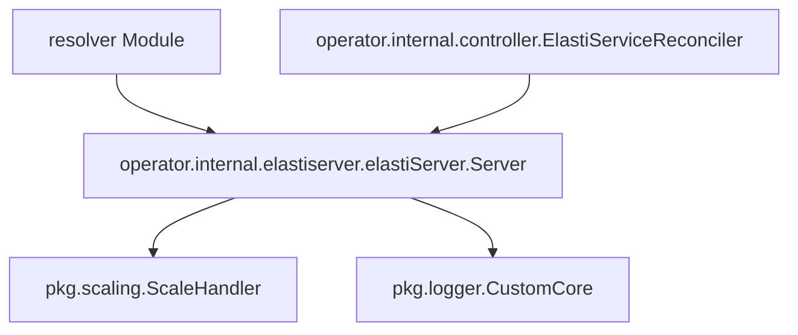

# ElastiServer Module Documentation

## Introduction

The `elastiserver` module, located within the `operator` package, provides the core server functionality for handling communications and events related to service scaling within the Kubernetes environment. Its primary role is to act as an intermediary, receiving signals (e.g., from the `resolver` module when a service requires scaling) and orchestrating the necessary scaling operations through the `ScaleHandler`.

## Core Functionality

The `elastiserver.elastiServer.Server` component is responsible for:
*   **Receiving Communications**: It is designed to receive communication from the `resolver` module, or other future components, about specific events.
*   **Event-Driven Scaling**: When a service, potentially managed by an `ElastiService` Custom Resource, receives a request and is currently at zero replicas, the `Server` can initiate a scale-up action for that service.
*   **Orchestrating Scaling Operations**: It leverages the `ScaleHandler` from the `pkg.scaling` module to execute the actual scaling logic.
*   **Logging**: Utilizes a logger for internal operations and debugging.

## Architecture and Component Relationships

The `elastiserver` module's architecture is centered around the `Server` component. This component integrates with several other modules to perform its functions effectively.

### Component Breakdown:

*   **`operator.internal.elastiserver.elastiServer.Server`**: The central component of this module. It encapsulates the logic for event reception and delegates scaling tasks.
    *   `logger *zap.Logger`: An instance of a logger, typically `pkg.logger.CustomCore`, used for structured logging of server operations and events.
    *   `scaleHandler *scaling.ScaleHandler`: A crucial dependency that provides the interface for interacting with various scalers to adjust the replica count of services.
    *   `rescaleDuration time.Duration`: Configurable duration to wait before re-checking for scaling opportunities.

## Integration with the Overall System

The `elastiserver` module plays a vital role within the larger `operator` system, facilitating the dynamic scaling of services.

*   **Operator Module**: As part of the `operator` module, `elastiserver` works in conjunction with components like the `controller` (specifically `ElastiServiceReconciler`) and `informer`. The controller might use the `ElastiServer` to trigger scaling actions based on observed `ElastiService` custom resources or events.
*   **Resolver Module**: The `elastiserver` receives communication from the `resolver` module. The `resolver` is responsible for routing requests and, in certain scenarios (e.g., a service is scaled to 0), it communicates with `elastiserver` to initiate a scale-up.
*   **PKG Module**:
    *   **Scaling (`pkg.scaling`)**: The `elastiserver` directly utilizes the `ScaleHandler` from the `pkg.scaling` module to perform the actual scaling operations, abstracting the details of different scaling mechanisms (e.g., Prometheus scaler). For more details, refer to the [scaling.md](scaling.md) documentation.
    *   **Logger (`pkg.logger`)**: It uses the logging utilities provided by `pkg.logger.CustomCore` to output operational information, errors, and debugging messages, which is crucial for monitoring and troubleshooting. For more details, refer to the [logger.md](logger.md) documentation.
    *   **Configuration (`pkg.config`)**: While not directly shown in the `Server` component's fields, it's highly probable that the `rescaleDuration` and other operational parameters are configured via the `pkg.config` module. For more details, refer to the [config.md](config.md) documentation.

In summary, the `elastiserver` module acts as a crucial event listener and scaling orchestrator, bridging external triggers (like those from the `resolver`) with the internal scaling mechanisms provided by the `pkg.scaling` module, all within the operational context of the `operator`.