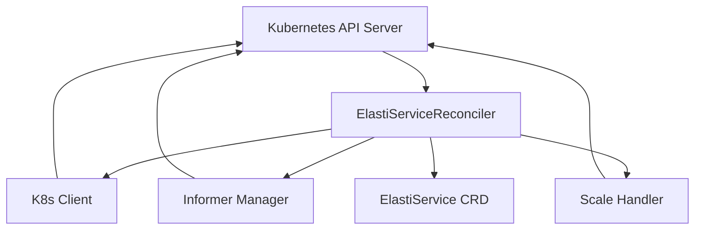

# elastiservice_controller Module Documentation

## Introduction

The `elastiservice_controller` module is a core component within the `operator` responsible for managing and reconciling `ElastiService` custom resources in a Kubernetes cluster. It implements the control loop pattern, continuously observing the desired state (defined by `ElastiService` objects) and attempting to bring the current state of the cluster in line with that desired state. This module orchestrates scaling operations and integrates with various internal operator components to provide dynamic scaling capabilities.

## Core Components

### `operator.internal.controller.elastiservice_controller.ElastiServiceReconciler`

The `ElastiServiceReconciler` is the primary struct in this module, responsible for the actual reconciliation logic of `ElastiService` custom resources. It implements the `Reconciler` interface from `controller-runtime` and contains the necessary clients, informers, and handlers to perform its duties.

**Definition:**

```go
type (
        SwitchModeFunc          func(ctx context.Context, req ctrl.Request, mode string) (res ctrl.Result, err error)
        ElastiServiceReconciler struct {
                client.Client
                Scheme             *kRuntime.Scheme
                Logger             *zap.Logger
                InformerManager    *informer.Manager
                SwitchModeLocks    sync.Map
                ScaleHandler       *scaling.ScaleHandler
                InformerStartLocks sync.Map
                ReconcileLocks     sync.Map
        }
)
```

**Fields:**

*   **`client.Client`**: A Kubernetes client used for performing CRUD (Create, Read, Update, Delete) operations on Kubernetes resources, including `ElastiService` objects and any other standard Kubernetes resources it needs to manage (e.g., Deployments, Services).
*   **`Scheme *kRuntime.Scheme`**: Provides the type scheme for all known API objects. It's crucial for understanding how to deserialize Kubernetes objects and for performing type conversions, especially when dealing with custom resources.
*   **`Logger *zap.Logger`**: An instance of a `zap` logger for structured and efficient logging throughout the reconciliation process, aiding in debugging and operational monitoring.
*   **`InformerManager *informer.Manager`**: Manages Kubernetes informers that watch for changes to `ElastiService` and potentially other related resources. It provides event-driven notifications to the reconciler, triggering reconciliation loops when changes occur. For more details, refer to the [operator_internal_informer.md](operator_internal_informer.md) documentation.
*   **`SwitchModeLocks sync.Map`**: A concurrency-safe map used to manage locks around operations related to switching scaling modes (e.g., manual, auto-scaling). This prevents race conditions during mode transitions.
*   **`ScaleHandler *scaling.ScaleHandler`**: An interface to the scaling logic that executes actual scaling operations based on the policies defined in the `ElastiService` resource. It abstracts away the specifics of how scaling is performed. For more details, refer to the [pkg_scaling_scale_handler.md](pkg_scaling_scale_handler.md) documentation.
*   **`InformerStartLocks sync.Map`**: Used to synchronize the startup of informers managed by the `InformerManager`, ensuring they are initialized correctly before processing events.
*   **`ReconcileLocks sync.Map`**: Provides a mechanism to lock specific `ElastiService` resources during their reconciliation process, preventing multiple concurrent reconciliation attempts for the same resource, which could lead to conflicts or incorrect state.

## Architecture and Component Relationships

The `elastiservice_controller` acts as the central orchestrator for `ElastiService` resources. It interacts with the Kubernetes API, leverages informers for eventing, and delegates actual scaling logic to the `ScaleHandler`.



**Explanation:**

*   The `ElastiServiceReconciler` (`B`) is the core logic that receives events (e.g., `ElastiService` created, updated, deleted) from the Kubernetes API Server (`A`) via its `Informer Manager` (`D`).
*   It uses the `Client` (`C`) to fetch, update, or delete `ElastiService` resources (`F`) and other related Kubernetes objects.
*   Based on the `ElastiServiceSpec`, the reconciler determines necessary scaling actions and delegates these to the `Scale Handler` (`E`).
*   The `Scale Handler` then interacts with the Kubernetes API Server to perform the actual scaling of target applications.

## How the Module Fits into the Overall System

The `elastiservice_controller` module is fundamental to the `operator`'s functionality. It forms the backbone of managing scalable services defined by `ElastiService` custom resources.

*   **Integration with `operator_api_v1alpha1`**: It consumes `ElastiService` objects defined in `operator.api.v1alpha1.elastiservice_types`, interpreting their specifications (`ElastiServiceSpec`) and updating their status (`ElastiServiceStatus`).
*   **Dependency on `operator_internal_informer`**: It relies on the `informer` package to efficiently watch and cache Kubernetes resources, ensuring timely reactions to changes without constantly polling the API server.
*   **Dependency on `pkg_scaling_scale_handler`**: It offloads the complex logic of actual scaling to the `ScaleHandler` in the `pkg.scaling` module, allowing the reconciler to focus solely on the control loop.
*   **Interaction with `operator_internal_crddirectory`**: While not directly shown in the `ElastiServiceReconciler` struct, the operator likely uses the `CRDDetails` and `Directory` from `operator.internal.crddirectory` to register and manage the `ElastiService` CRD itself, ensuring the Kubernetes cluster understands this custom resource.
*   **Collaboration with `operator_internal_elastiserver`**: The `elastiServer` might be responsible for exposing metrics or an API that the reconciler or other components use to make scaling decisions or report status.

In essence, the `elastiservice_controller` acts as the brain of the `ElastiService` operator, translating desired state into actual infrastructure changes within the Kubernetes environment, leveraging other internal operator components and external libraries to achieve its goals.
