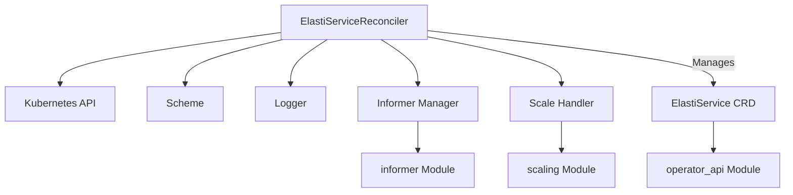

# ElastiService Controller Module

## Introduction
The `elastiservice_controller` module, primarily embodied by the `ElastiServiceReconciler` component, is a crucial part of the Kubernetes operator responsible for managing `ElastiService` custom resources. It implements the core reconciliation logic, ensuring that the actual state of `ElastiService` objects within the cluster matches their desired state as defined by users.

## Core Functionality

The primary component within this module is `ElastiServiceReconciler`, which orchestrates the reconciliation process for `ElastiService` custom resources.

### operator.internal.controller.elastiservice_controller.ElastiServiceReconciler

The `ElastiServiceReconciler` is a struct that embodies the logic for handling `ElastiService` objects. It is responsible for:
*   Watching for changes to `ElastiService` resources.
*   Determining the necessary scaling actions based on the `ElastiServiceSpec`.
*   Interacting with the Kubernetes API to apply changes.
*   Updating the `ElastiServiceStatus` to reflect the current state.

```go
type (
        SwitchModeFunc          func(ctx context.Context, req ctrl.Request, mode string) (res ctrl.Result, err error)
        ElastiServiceReconciler struct {
                client.Client
                Scheme             *kRuntime.Scheme
                Logger             *zap.Logger
                InformerManager    *informer.Manager
                SwitchModeLocks    sync.Map
                ScaleHandler       *scaling.ScaleHandler
                InformerStartLocks sync.Map
                ReconcileLocks     sync.Map
        }
)
```

**Key Fields:**
*   `client.Client`: A Kubernetes client used to interact with the Kubernetes API server, allowing the reconciler to fetch, create, update, and delete Kubernetes resources.
*   `Scheme`: The Kubernetes runtime scheme, providing information about all the types the controller is aware of.
*   `Logger`: A `zap.Logger` instance used for structured logging within the reconciliation loop, aiding in debugging and operational insights.
*   `InformerManager`: An instance from the `informer` module, responsible for managing Kubernetes informers. Informers provide event-driven updates about resource changes, reducing the load on the API server and enabling efficient reconciliation. See [informer.md](informer.md) for more details.
*   `SwitchModeLocks`, `InformerStartLocks`, `ReconcileLocks`: `sync.Map` instances used for concurrency control, ensuring that critical sections of the reconciliation logic are protected and prevent race conditions during concurrent operations.
*   `ScaleHandler`: An instance from the `pkg.scaling` module, responsible for executing the actual scaling operations based on the `ElastiServiceSpec`. This component abstracts the underlying scaling logic. See [pkg_scaling.md](pkg_scaling.md) for more details.

## Architecture and Component Relationships

The `elastiservice_controller` module integrates with several other modules to perform its duties effectively.



*   **Kubernetes API (`client.Client`, `Scheme`):** The reconciler directly interacts with the Kubernetes API server to manage `ElastiService` resources and their dependent objects.
*   **Informer Module (`InformerManager`):** The `InformerManager` orchestrates informers that watch for changes in `ElastiService` and other related resources, pushing these events to the reconciler for processing.
*   **Scaling Module (`ScaleHandler`):** The `ScaleHandler` is delegated the responsibility of executing scaling logic, abstracting the details of how different types of scaling are performed.
*   **operator_api Module (`ElastiService CRD`):** The `ElastiServiceReconciler` operates on `ElastiService` Custom Resources, whose definitions (Spec and Status) are provided by the `operator_api` module.

## How the Module Fits into the Overall System

The `elastiservice_controller` module is a core component within the larger `operator` system. It serves as the brain of the operator, translating the declarative `ElastiService` specifications into concrete actions within the Kubernetes cluster. It sits within the `operator.internal.controller` package, indicating its central role in controlling and managing the lifecycle of `ElastiService` instances. By reconciling `ElastiService` resources, it ensures that the autoscaling and operational requirements defined by users are continuously met, making it integral to the operator's ability to provide elastic service management.
