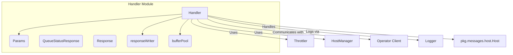

# Handler Module Documentation

## Introduction
The `handler` module in the `resolver` service is responsible for handling incoming HTTP requests, acting as a reverse proxy. It orchestrates traffic management, applies throttling mechanisms, interacts with host management, and communicates with the operator for request information. This module is central to how the `resolver` processes and routes requests to appropriate backend services.

## Core Functionality

The `handler` module provides the following core functionalities:
*   **Request Handling**: Processes incoming HTTP requests through a reverse proxy.
*   **Throttling**: Integrates with the `throttler` module to apply rate limiting and circuit breaking strategies.
*   **Host Management**: Utilizes the `host_manager` module to determine the target host for a request and manage host traffic.
*   **Operator Communication**: Sends information about incoming requests to the `operator_client` module for monitoring and control.
*   **Response Generation**: Manages the construction and writing of HTTP responses, including custom status and body handling.

## Architecture and Component Relationships

The `handler` module's architecture is centered around the `Handler` struct, which acts as the main entry point for request processing. It leverages several internal components and interacts with external modules to perform its duties.



### Key Components:

*   **`Handler` (resolver.internal.handler.handler.HostManager)**: This is the primary component of the module, implementing the reverse proxy logic. It holds references to a logger, a throttler, an HTTP transport, a buffer pool, an operator client, and a host manager.

    ```go
    type Handler struct {
        logger      *zap.Logger
        throttler   *throttler.Throttler
        transport   http.RoundTripper
        bufferPool  httputil.BufferPool
        timeout     time.Duration
        operatorRPC Operator
        hostManager HostManager
    }
    ```

*   **`Params` (resolver.internal.handler.handler.HostManager)**: Configuration structure for initializing the `Handler`.

    ```go
    type Params struct {
        Logger      *zap.Logger
        ReqTimeout  time.Duration
        OperatorRPC Operator
        HostManager HostManager
        Throttler   *throttler.Throttler
        Transport   http.RoundTripper
    }
    ```

*   **`Operator` Interface (resolver.internal.handler.handler.HostManager)**: Defines the contract for communicating with the operator. The concrete implementation is found in the `operator_client` module.

    ```go
    type Operator interface {
        SendIncomingRequestInfo(ns, svc string)
    }
    ```

*   **`HostManager` Interface (resolver.internal.handler.handler.HostManager)**: Defines the contract for managing hosts and their traffic. The concrete implementation is found in the `host_manager` module.

    ```go
    type HostManager interface {
        GetHost(req *http.Request) (*messages.Host, error)
        DisableTrafficForHost(service string)
    }
    ```

*   **`QueueStatusResponse` (resolver.internal.handler.handler.QueueStatusResponse)**: A simple structure for responses indicating queue status.

    ```go
    type QueueStatusResponse struct {
        QueueStatus int `json:"queueStatus"`
    }
    ```

*   **`Response` (resolver.internal.handler.handler.Response)**: A generic structure for simple message responses.

    ```go
    type Response struct {
        Message string `json:"message"`
    }
    ```

*   **`bufferPool` (resolver.internal.handler.handler.bufferPool)**: A custom implementation of `httputil.BufferPool` using `sync.Pool` for efficient buffer reuse.

    ```go
    type bufferPool struct {
        pool *sync.Pool
    }
    ```

*   **`responseWriter` (resolver.internal.handler.writer.responseWriter)**: A wrapper around `http.ResponseWriter` that captures the status code and body for custom response handling or logging.

    ```go
    type responseWriter struct {
        http.ResponseWriter
        statusCode int
        body       []byte
    }
    ```

### External Module Dependencies:

*   **`throttler` Module**: The `Handler` utilizes `throttler.Throttler` for managing request rates and implementing circuit breakers. See [throttler.md](throttler.md) for more details.
*   **`host_manager` Module**: The `Handler` relies on the `HostManager` interface, which is implemented by the `resolver.internal.hostmanager.hostManager.HostManager` component. This module is responsible for selecting and managing backend hosts. See [host_manager.md](host_manager.md) for more details.
*   **`operator_client` Module**: The `Handler` communicates with the `operator_client` through the `Operator` interface (implemented by `resolver.internal.operator.RPCClient.Client`) to send information about incoming requests to the operator. See [operator_client.md](operator_client.md) for more details.
*   **`pkg` Module**: The `handler` module interacts with `messages.Host` from the `pkg` module when retrieving host information from the `HostManager`. See [pkg.md](pkg.md) for more details.

## How the Module Fits into the Overall System

The `handler` module is a critical component within the `resolver` service, sitting at the forefront of request processing. It acts as the intelligent entry point, mediating between incoming client requests and the backend services or the `operator`'s control plane.

It integrates with:
*   **Load Balancing**: By using the `host_manager` to select appropriate hosts.
*   **Traffic Management**: Through its integration with the `throttler` for flow control.
*   **Observability/Control Plane**: By sending request metadata to the `operator_client`.
*   **Configuration**: Initialized with parameters from the `main_config` module, defining its behavior and external dependencies. See [main_config.md](main_config.md) for more details.

In essence, the `handler` module ensures that incoming requests are properly routed, controlled, and monitored, forming a crucial part of the `resolver`'s ability to efficiently and reliably manage traffic.