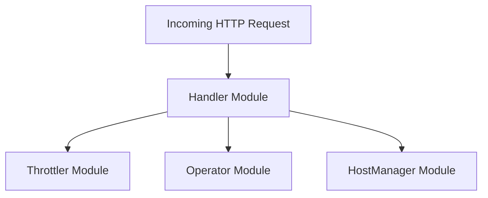

# Handler Module Documentation

## Introduction

The `handler` module in the `resolver` service is responsible for processing incoming HTTP requests, interacting with the host manager and operator, and managing request throttling. It acts as the central point for routing requests to appropriate backend services and ensuring the stability and performance of the system.

## Architecture Overview

The `handler` module integrates with several other core components of the `resolver` system to fulfill its responsibilities:



The `Handler` within this module orchestrates the flow of requests, utilizing the `Throttler` for rate limiting and circuit breaking, the `Operator` for communicating with the Kubernetes operator, and the `HostManager` for selecting and managing target hosts.

## Core Functionality and Components

The `handler` module comprises several key components that work together to manage request processing:

### `Handler` (resolver.internal.handler.handler.HostManager)

This is the central component of the `handler` module. It defines the main `Handler` struct, which contains the necessary dependencies and configuration for processing requests. It also defines `Params` for configuring the handler and crucial interfaces `Operator` and `HostManager` that outline the expected interactions with external modules.

#### `Handler` Struct
```go
type Handler struct {
	logger      *zap.Logger
	throttler   *throttler.Throttler
	transport   http.RoundTripper
	bufferPool  httputil.BufferPool
	timeout     time.Duration
	operatorRPC Operator
	hostManager HostManager
}
```
The `Handler` struct encapsulates the dependencies required for request processing, including a logger, a throttler, an HTTP transport, a buffer pool, a request timeout, an operator RPC client, and a host manager.

#### `Params` Struct
```go
type Params struct {
	Logger      *zap.Logger
	ReqTimeout  time.Duration
	OperatorRPC Operator
	HostManager HostManager
	Throttler   *throttler.Throttler
	Transport   http.RoundTripper
}
```
The `Params` struct is used to configure and initialize the `Handler` with its required dependencies.

#### `Operator` Interface
```go
type Operator interface {
	SendIncomingRequestInfo(ns, svc string)
}
```
The `Operator` interface defines the contract for communicating with the Kubernetes operator, primarily for sending information about incoming requests.

#### `HostManager` Interface
```go
type HostManager interface {
	GetHost(req *http.Request) (*messages.Host, error)
	DisableTrafficForHost(service string)
}
```
The `HostManager` interface defines methods for managing backend hosts, including retrieving a host for a given request and disabling traffic to a specific service.

### `responseWriter` (resolver.internal.handler.writer.responseWriter)

The `responseWriter` is a custom implementation of `http.ResponseWriter` that allows capturing the HTTP status code and response body before writing them back to the client. This is useful for logging or modifying responses.

```go
type responseWriter struct {
	http.ResponseWriter
	statusCode int
	body       []byte
}
```

### `Response` (resolver.internal.handler.handler.Response)

This struct defines a generic JSON response structure used for returning simple messages to the client.

```go
type Response struct {
	Message string `json:"message"`
}
```

### `QueueStatusResponse` (resolver.internal.handler.handler.QueueStatusResponse)

This struct is used to convey the status of a request within a queue, typically indicating whether a request was successfully queued or if there were issues.

```go
type QueueStatusResponse struct {
	QueueStatus int `json:"queueStatus"`
}
```

### `bufferPool` (resolver.internal.handler.handler.bufferPool)

The `bufferPool` component provides a mechanism for efficiently managing byte buffers using `sync.Pool`. This helps reduce memory allocations and garbage collection overhead, especially in high-throughput scenarios where many temporary buffers are needed for request and response bodies.

```go
type bufferPool struct {
	pool *sync.Pool
}
```
