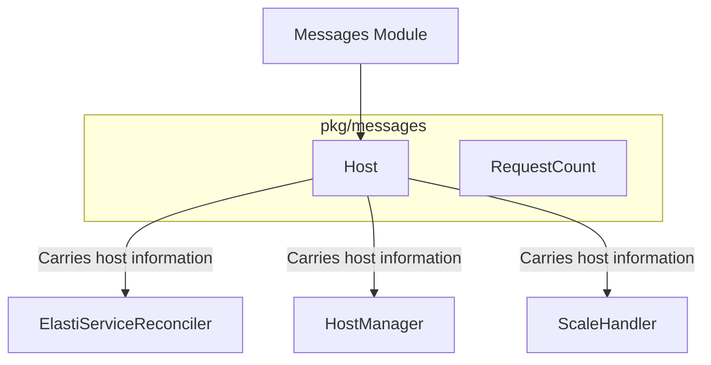

# Host Module Documentation

## Introduction
The `host_go` module, located within the `pkg/messages` package, defines the `Host` struct. This struct serves as a fundamental data structure for encapsulating detailed information about hosts involved in service communication, including their identity, namespace, and traffic routing status. It is crucial for facilitating inter-service communication and decision-making within the system.

## Core Functionality

### `pkg.messages.host.Host`
The `Host` struct is a Go data structure that holds comprehensive details about a host involved in a communication flow. It captures essential metadata required for routing, traffic management, and policy enforcement.

```go
type Host struct {
        IncomingHost   string
        Namespace      string
        SourceService  string
        TargetService  string
        SourceHost     string
        TargetHost     string
        TrafficAllowed bool
}
```

**Fields:**
* `IncomingHost` (string): The identifier of the host receiving traffic.
* `Namespace` (string): The Kubernetes namespace to which the host belongs.
* `SourceService` (string): The name of the service initiating the communication.
* `TargetService` (string): The name of the service that is the target of the communication.
* `SourceHost` (string): The actual host identifier of the source.
* `TargetHost` (string): The actual host identifier of the target.
* `TrafficAllowed` (bool): A flag indicating whether traffic is permitted between the source and target.

## Architecture and Component Relationships

The `Host` struct plays a central role in various parts of the system, particularly in how services communicate and how those communications are managed and potentially scaled. It acts as a message format, carrying vital context between different components.



## How the Module Fits into the Overall System
The `host_go` module, through its `Host` struct, is a critical data carrier that enables communication and coordination across the microservices. It provides the necessary context for the `operator` to manage `ElastiService` resources, for the `resolver` to correctly route traffic and manage host states, and for the `scaling` components to make informed scaling decisions based on traffic and service interactions. It essentially defines the "envelope" for host-related communication within the system, ensuring that all relevant information is consistently available where needed.