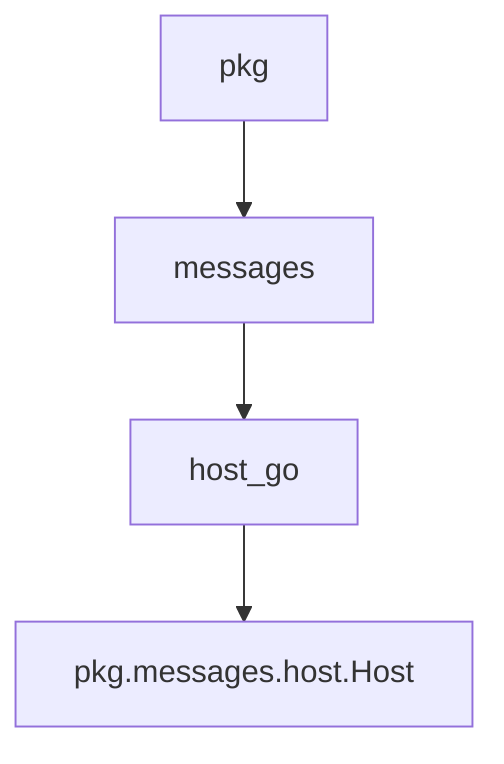

# host_go Module Documentation

## Introduction

The `host_go` module, residing within the `pkg.messages` package, defines the `Host` structure. This structure is a fundamental data representation used across the system to encapsulate detailed information about hosts involved in service communication and traffic management. It plays a critical role in standardizing how host-related metadata is exchanged and processed.

## Core Functionality and Purpose

The primary purpose of the `host_go` module is to provide a clear and consistent definition for host entities. The `Host` struct includes several key fields that describe various aspects of a host and its role in a request or operation.

### `Host` Struct

The `Host` struct (defined in `pkg/messages/host.go`) contains the following fields:

```go
type Host struct {
	IncomingHost   string
	Namespace      string
	SourceService  string
	TargetService  string
	SourceHost     string
	TargetHost     string
	TrafficAllowed bool
}
```

-   **`IncomingHost`**: Represents the hostname or IP address from which a request is originating or being received.
-   **`Namespace`**: The Kubernetes namespace associated with the host or the services involved.
-   **`SourceService`**: The name of the service initiating the request.
-   **`TargetService`**: The name of the service that is the intended recipient of the request.
-   **`SourceHost`**: The specific host (e.g., pod name or IP) where the source service is running.
-   **`TargetHost`**: The specific host (e.g., pod name or IP) where the target service is running.
-   **`TrafficAllowed`**: A boolean flag indicating whether traffic is permitted for this host or between the specified source and target.

This structure facilitates the reliable passing of host context between different components of the system, such as resolvers and operators, enabling informed decisions on traffic routing, access control, and observability.

## Architecture and Component Relationships

The `host_go` module is a part of the `pkg.messages` package, which is responsible for defining common data structures used for inter-component communication. The `Host` struct is a key message type that allows various parts of the system to communicate information about network endpoints and service interactions.



The `Host` struct is utilized by modules that need to process or make decisions based on host-specific information, such as the `resolver` module for routing requests or the `operator` module for managing service instances. For more details on other message types, refer to the [messages module documentation](messages.md).
