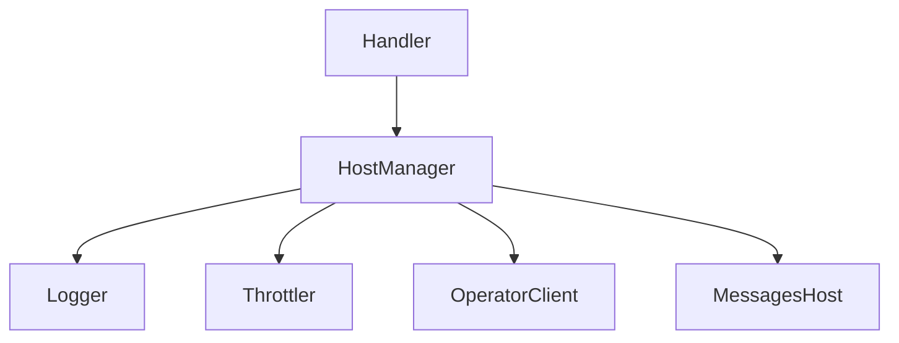

# Host Manager Module


## Introduction

The `host_manager` module, located at `resolver/internal/hostmanager`, is a foundational component within the `resolver` system. It is primarily responsible for maintaining an up-to-date registry of available backend hosts and managing their operational status. This module plays a critical role in ensuring that the `resolver` can efficiently route requests to healthy hosts and react to host failures or recoveries.

## Purpose and Core Functionality

The `host_manager` module's core functionality is encapsulated within the `HostManager` struct. This component provides mechanisms for:

*   **Host Registration and Discovery:** Maintaining a dynamic collection of hosts that the resolver can target for request forwarding.
*   **Host Health Management:** Tracking the operational status of individual hosts. This likely includes marking hosts as unhealthy and subsequently re-enabling them after a specified duration, indicating integration with circuit breaking or throttling mechanisms.
*   **Logging:** Utilizing a structured logging mechanism (`zap.Logger`) to record events and state changes related to host management, aiding in debugging and operational monitoring.
*   **Header Management:** Providing a configurable header for host identification or communication.

### Core Component: `resolver.internal.hostmanager.hostManager.HostManager`

```go
type HostManager struct {
    logger                  *zap.Logger
    hosts                   sync.Map
    trafficReEnableDuration time.Duration
    headerForHost           string
}
```

*   `logger (*zap.Logger)`: An instance of `zap.Logger` used for logging host-related events and errors. This provides detailed insights into the HostManager's operations.
*   `hosts (sync.Map)`: A concurrent map used to store and manage the collection of hosts. This allows for safe concurrent access and modification of host information. Each entry likely maps a host identifier to its current state or metadata.
*   `trafficReEnableDuration (time.Duration)`: Specifies the duration after which a host, previously marked as unhealthy or temporarily disabled, should be considered for re-enabling traffic. This parameter is crucial for implementing graceful recovery and circuit breaking patterns.
*   `headerForHost (string)`: A custom header string that might be appended to requests or used in internal communication to identify or categorize hosts.

## Architecture and Component Relationships

The `HostManager` module interacts with several other components within the `resolver` and `pkg` systems to fulfill its responsibilities.



*   **Logger (`pkg.logger`):** The `HostManager` extensively uses the logging facilities provided by the `pkg.logger` module (specifically `pkg.logger.logger.CustomCore`) to record its operations, host status changes, and any encountered errors.
*   **Throttler (`resolver.internal.throttler`):** Given the `trafficReEnableDuration` field, the `HostManager` likely works in conjunction with the `throttler` module (e.g., `resolver.internal.throttler.breaker.Breaker` or `semaphore`) to implement circuit breaking or load shedding. When a host becomes unhealthy, the `HostManager` might signal the `Throttler` to temporarily stop sending traffic to it, and the duration dictates when to re-evaluate its health.
*   **Handler (`resolver.internal.handler`):** The `resolver.internal.handler.handler.HostManager` component within the `handler` module suggests that the `HostManager` module provides the concrete implementation of host management that the `handler` uses to determine target hosts for incoming requests.
*   **Operator Client (`resolver.internal.operator.RPCClient`):** The `HostManager` might need to communicate with the `operator` (via `RPCClient.Client`) to fetch host configurations, receive updates about host status, or report host health metrics back to the control plane.
*   **Messages Host (`pkg.messages.host`):** The `HostManager` would likely process and store host-related information using data structures defined in `pkg.messages.host.Host`.

## How the Module Fits into the Overall System

The `host_manager` module is a critical piece of the `resolver`'s runtime infrastructure. It acts as the authoritative source for the current state of backend hosts, enabling the `resolver` to:

*   **Make intelligent routing decisions:** By providing a list of healthy and available hosts, the `resolver` can efficiently distribute incoming requests, avoiding overloaded or faulty instances.
*   **Enhance system resilience:** Through its ability to temporarily disable unhealthy hosts and gracefully re-enable them, the `HostManager` contributes to the overall fault tolerance and reliability of the `resolver` system.
*   **Support dynamic scaling:** In conjunction with the `operator` and `pkg.scaling` modules, the `HostManager` can adapt to changes in the underlying host pool, accommodating scaling events by adding or removing hosts from its managed set.

Its central role ensures that the `resolver` can maintain high availability and performance by continuously optimizing its selection of target hosts.
