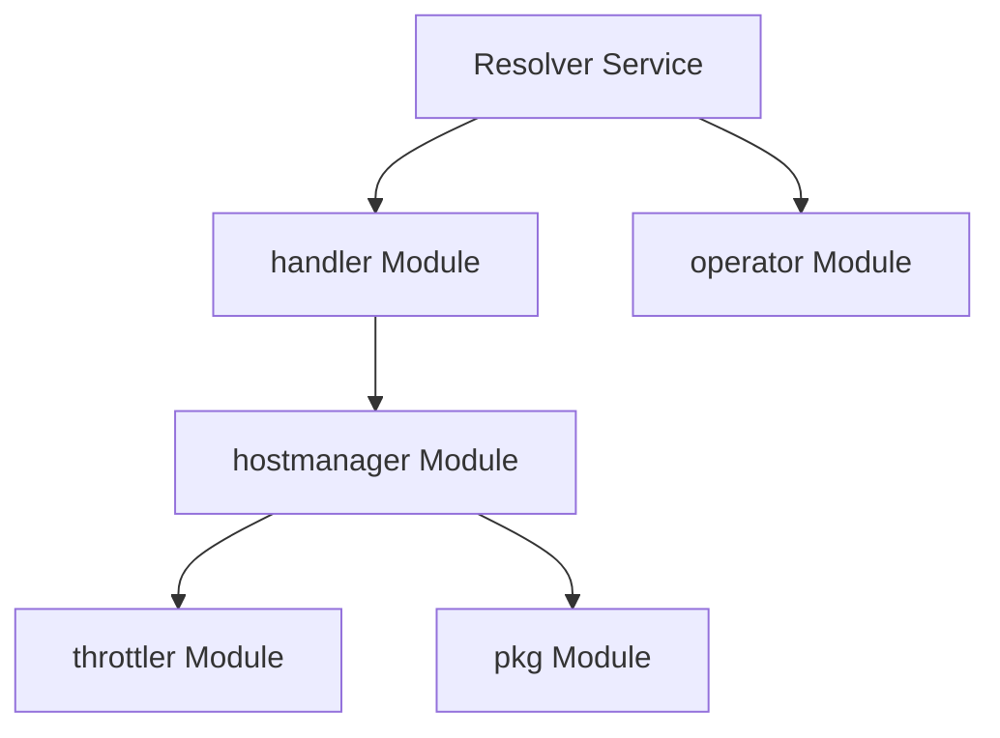

# hostmanager Module Documentation

## Introduction

The `hostmanager` module is a critical component within the `resolver` service, primarily responsible for managing the lifecycle and state of various backend hosts. It maintains an up-to-date registry of available hosts, handles their health status, and facilitates the dynamic routing of traffic by enabling or disabling hosts based on operational criteria.

## Core Functionality

The core functionality of the `hostmanager` module revolves around the `HostManager` struct, which encapsulates the logic for host registration, status tracking, and traffic management.

### HostManager

The `resolver.internal.hostmanager.hostManager.HostManager` struct is the central component of this module. It manages a collection of hosts, providing mechanisms to interact with their operational status.

```go
type HostManager struct {
	logger                  *zap.Logger
	hosts                   sync.Map
	trafficReEnableDuration time.Duration
	headerForHost           string
}
```

*   `logger`: An instance of `zap.Logger` used for structured logging within the host manager, providing insights into host status changes and operational events.
*   `hosts`: A `sync.Map` that stores information about all managed hosts. This concurrent map ensures thread-safe access to host data across multiple goroutines, crucial for high-concurrency environments.
*   `trafficReEnableDuration`: A `time.Duration` specifying how long a host, once disabled, should remain in that state before traffic is automatically re-enabled. This helps in implementing circuit breaker patterns or graceful degradation.
*   `headerForHost`: A string representing an HTTP header key that might be used to identify specific hosts in incoming requests or for internal routing logic.

The `HostManager` is responsible for:
*   Maintaining the current state (e.g., active, disabled) of all managed hosts.
*   Providing an interface for other modules to query host status.
*   Potentially coordinating with traffic management systems to direct or halt traffic to specific hosts.

## Architecture and Component Relationships

The `hostmanager` module is an integral part of the `resolver` service. It interacts closely with the `handler` module, which likely uses the `HostManager` to make routing decisions for incoming requests. It may also interact with `throttler` components to apply dynamic rate limiting or circuit breaking based on host health or load.



### Relationships:

*   **`handler` Module**: The `handler` module (specifically `resolver.internal.handler.handler.HostManager`) is a primary consumer of the `hostmanager`. It uses the `HostManager` instance to make decisions about which backend hosts to route requests to, based on their availability and status.
*   **`throttler` Module**: The `hostmanager` likely interacts with the `throttler` module (e.g., `resolver.internal.throttler.breaker.Breaker`) to implement fault tolerance mechanisms like circuit breaking. If a host consistently fails, the `hostmanager` might instruct the `throttler` to open a circuit for that host, preventing further requests from being sent to it for a defined period.
*   **`pkg` Module**: The `hostmanager` may utilize shared utilities or data structures defined in the `pkg` module, such as `pkg.messages.host.Host` for host representation or `pkg.logger.logger.CustomCore` for logging configurations.
*   **`operator` Module**: While not a direct dependency in the immediate `HostManager` struct, the `resolver` service, which contains `hostmanager`, communicates with the `operator` module via an RPC client (`resolver.internal.operator.RPCClient.Client`). This suggests that the `hostmanager`'s actions or host status might be reported to or influenced by the `operator` for higher-level orchestration.

## How the Module Fits into the Overall System

The `hostmanager` module is a cornerstone of the `resolver`'s ability to maintain high availability and resilience. It acts as the "brain" for backend host selection and management. When a request comes into the `resolver`, the `handler` module consults the `hostmanager` to determine the most suitable and available host for processing the request.

By dynamically enabling and disabling hosts, and potentially integrating with throttling mechanisms, the `hostmanager` ensures that traffic is only directed to healthy and capable instances, thereby preventing cascading failures and improving the overall stability and performance of the `resolver` service. It is essential for implementing robust load balancing, failover, and fault tolerance strategies in a distributed environment.