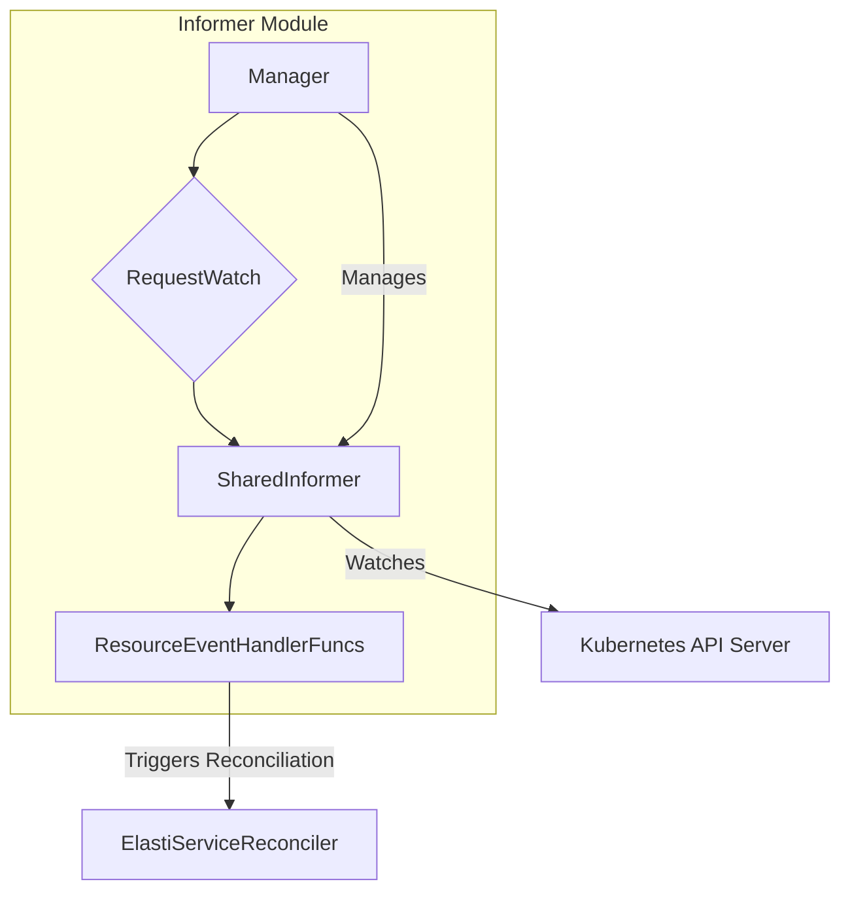

# Informer Module Documentation

## Introduction

The `informer` module, located within `operator.internal.informer`, is a critical component of the operator responsible for actively monitoring Kubernetes resources. It leverages shared informers to watch for changes in specified resources, such as custom resources defined by the operator, and provides a mechanism to react to these changes. This allows the operator to maintain an up-to-date state of the cluster and trigger reconciliation processes when necessary.

## Core Functionality and Components

The `informer` module's primary role is to establish and manage Kubernetes informers. These informers are essential for the operator to receive notifications about create, update, and delete events for the resources it manages. Key components facilitating this functionality include `KeyParams` and `RequestWatch`.

### KeyParams

`KeyParams` is a structure used to uniquely identify a Kubernetes resource within the informer system. It encapsulates the necessary information to pinpoint a specific instance of a resource.

```go
type KeyParams struct {
	Namespace    string
	CRDName      string
	ResourceType string
	ResourceName string
}
```

*   **Namespace**: The Kubernetes namespace where the resource resides.
*   **CRDName**: The name of the Custom Resource Definition (CRD) to which the resource belongs.
*   **ResourceType**: The type of the resource (e.g., "ElastiService").
*   **ResourceName**: The specific name of the resource instance.

### RequestWatch

`RequestWatch` defines the parameters for initiating a watch on a Kubernetes resource. It includes details about the resource to be watched and the handlers that will process the events generated by the informer.

```go
type (
	// Manager helps manage lifecycle of informer
	Manager struct {
		client              *kubernetes.Clientset
		dynamicClient       *dynamic.DynamicClient
		logger              *zap.Logger
		informers           sync.Map
		resolver            info
		resyncPeriod        time.Duration
		healthCheckDuration time.Duration
		healthCheckStopChan chan struct{}
	}

	info struct {
		Informer cache.SharedInformer
		StopCh   chan struct{}
		Req      *RequestWatch
	}

	// RequestWatch is the request body sent to the informer
	RequestWatch struct {
		Req                  ctrl.Request
		ResourceName         string
		ResourceNamespace    string		
		GroupVersionResource *schema.GroupVersionResource
		Handlers             cache.ResourceEventHandlerFuncs
	}
)
```

*   **Manager**: This internal struct within the informer module is responsible for the overall lifecycle management of informers. It holds Kubernetes clients, a logger, a map of active informers, and configuration for resynchronization and health checks. The `Manager` orchestrates the creation, stopping, and health monitoring of individual informers.
*   **info**: An auxiliary struct used by the `Manager` to hold an `Informer` instance, its stop channel, and the original `RequestWatch` associated with it.
*   **Req**: The `ctrl.Request` object from `controller-runtime`, often used to queue a reconciliation request.
*   **ResourceName**: The name of the resource instance to watch.
*   **ResourceNamespace**: The namespace of the resource instance to watch.
*   **GroupVersionResource**: A Kubernetes `schema.GroupVersionResource` struct that uniquely identifies the API resource type being watched (e.g., `elastiservices.v1alpha1.operator.example.com`).
*   **Handlers**: A set of `cache.ResourceEventHandlerFuncs` that define callback functions to be executed when a resource is added, updated, or deleted.

## Architecture and Component Relationships

The informer module is central to the operator's ability to react to changes in the Kubernetes cluster. The `Manager` component is the orchestrator, utilizing `RequestWatch` to set up and manage individual informers. These informers, in turn, leverage Kubernetes API clients to watch specific resources.



## System Integration

The `informer` module is a fundamental building block for the `operator` package. It provides the crucial event-driven mechanism that allows the `ElastiServiceReconciler` to be notified of changes to `ElastiService` custom resources or any other Kubernetes resources it needs to manage.

1.  **Event-Driven Reconciliation**: When an `ElastiService` resource is created, updated, or deleted, the `informer` module detects these changes and invokes the registered `ResourceEventHandlerFuncs`. These handlers typically queue a `reconcile.Request` for the `ElastiServiceReconciler`.
2.  **Resource State Management**: By continuously watching resources, the informer ensures that the operator always has the most current state of the cluster, which is vital for making informed decisions during reconciliation.
3.  **Dependency on API Definitions**: The `informer` module relies heavily on the resource definitions provided by `operator.api.v1alpha1.elastiservice_types` (e.g., `ElastiService`, `ElastiServiceSpec`, `ElastiServiceStatus`) to understand the structure of the resources it is watching and processing.

For more details on the `ElastiService` Custom Resource Definition and its related types, refer to the [api_v1alpha1.md](api_v1alpha1.md) documentation.

For information on how the reconciliation process is handled, refer to the [elastiservice_controller.md](elastiservice_controller.md) documentation.