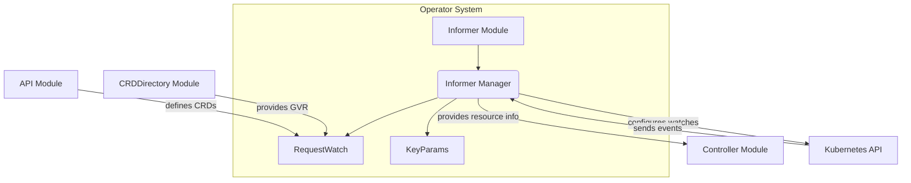

# Informer Module Documentation

## Introduction

The `informer` module, located at `operator/internal/informer`, is a crucial component within the `operator` system. Its primary responsibility is to observe and react to changes in Kubernetes resources, particularly Custom Resources (CRs) defined by the operator. It achieves this by setting up and managing Kubernetes informers, which provide a mechanism to receive notifications about resource creations, updates, and deletions. This module ensures that the `operator` can maintain an up-to-date cache of relevant resources and trigger appropriate actions when changes occur.

## Core Functionality

The `informer` module provides the foundational mechanisms for watching Kubernetes resources. It defines structures and logic to configure and manage these watchers.

### `RequestWatch`

The `RequestWatch` struct (`operator.internal.informer.informer.RequestWatch`) encapsulates the necessary parameters to define what resource an informer should watch and how to handle events for that resource.

```go
type RequestWatch struct {
	Req                  ctrl.Request
	ResourceName         string
	ResourceNamespace    string
	GroupVersionResource *schema.GroupVersionResource
	Handlers             cache.ResourceEventHandlerFuncs
}
```

*   **`Req`**: A controller-runtime request, often used to identify the object triggering the watch.
*   **`ResourceName`**: The name of the specific resource to watch (if watching a single instance).
*   **`ResourceNamespace`**: The namespace of the resource to watch.
*   **`GroupVersionResource`**: A critical identifier for the type of Kubernetes resource being watched (e.g., `apiVersion: "v1alpha1"`, `kind: "ElastiService"`). This is typically obtained from the Kubernetes API or details stored in the `crddirectory` module.
*   **`Handlers`**: A set of callback functions (`cache.ResourceEventHandlerFuncs`) that are executed when a resource is added, updated, or deleted. These handlers allow the `informer` module to propagate events to other parts of the operator, such as the `controller` module.

The `Manager` struct within the `informer` module is responsible for managing the lifecycle of these informers, using `*kubernetes.Clientset` and `*dynamic.DynamicClient` to interact with the Kubernetes API, and maintaining a `sync.Map` of active informers.

### `KeyParams`

The `KeyParams` struct (`operator.internal.informer.informer.KeyParams`) provides a standardized way to identify a specific resource based on its metadata.

```go
type KeyParams struct {
	Namespace    string
	CRDName      string
	ResourceType string
	ResourceName string
}
```

*   **`Namespace`**: The namespace where the resource resides.
*   **`CRDName`**: The name of the Custom Resource Definition (CRD) this resource belongs to.
*   **`ResourceType`**: The specific type of the resource (e.g., "ElastiService").
*   **`ResourceName`**: The name of the individual resource instance.

This struct is likely used for lookup, indexing, or for constructing unique keys to refer to watched resources within the `informer`'s internal caches or when communicating with other modules.

## Architecture and Component Relationships

The `informer` module is central to the `operator`'s ability to react to changes in the Kubernetes environment. It interacts with several other key modules and the Kubernetes API.



*   **`Informer Module`**: Contains the `Manager`, `RequestWatch`, and `KeyParams` components.
*   **`Informer Manager`**: The central orchestrator within the `informer` module, responsible for creating, starting, and stopping Kubernetes informers based on `RequestWatch` configurations. It interacts directly with the `Kubernetes API` to establish watches and receive events.
*   **`RequestWatch`**: Defines the parameters for a specific watch, including event `Handlers`.
*   **`KeyParams`**: Used for identifying and referencing watched resources.
*   **`Kubernetes API`**: The external interface that the `informer` module interacts with to set up watches and receive resource events.
*   **`Controller Module`**: The `informer` module provides resource events (add, update, delete) to the `controller` module (specifically, `ElastiServiceReconciler`) through the `Handlers` defined in `RequestWatch`. This allows the controller to reconcile desired states with actual states.
*   **`API Module`**: Defines the Custom Resource Definitions (CRDs) like `ElastiService` (`operator.api.v1alpha1.elastiservice_types.ElastiService`). The `GroupVersionResource` within `RequestWatch` refers to these definitions.
*   **`CRDDirectory Module`**: This module (`operator.internal.crddirectory.directory.Directory`, `operator.internal.crddirectory.directory.CRDDetails`) is likely used to retrieve the `GroupVersionResource` information dynamically for the CRDs, which is then used to configure `RequestWatch`.

## How the Module Fits into the Overall System

The `informer` module is a cornerstone of the `operator`'s reactive architecture. It provides the mechanism for the `operator` to become aware of changes to `ElastiService` Custom Resources (and potentially other resources it manages) without constantly polling the Kubernetes API.

When an `ElastiService` resource is created, updated, or deleted, the `informer` module's configured informers detect these changes via the `Kubernetes API`. The `Handlers` specified in the `RequestWatch` then trigger the appropriate reconciliation logic within the `controller` module. For example, if an `ElastiService` is updated, the `informer` will notify the `ElastiServiceReconciler` in the `controller` module, prompting it to re-evaluate the desired state and make necessary adjustments to the underlying Kubernetes resources.

In essence, the `informer` module acts as the eyes and ears of the `operator`, allowing it to respond efficiently and effectively to the dynamic state of the Kubernetes cluster, driving the operator's core automation capabilities for `ElastiService` instances.
