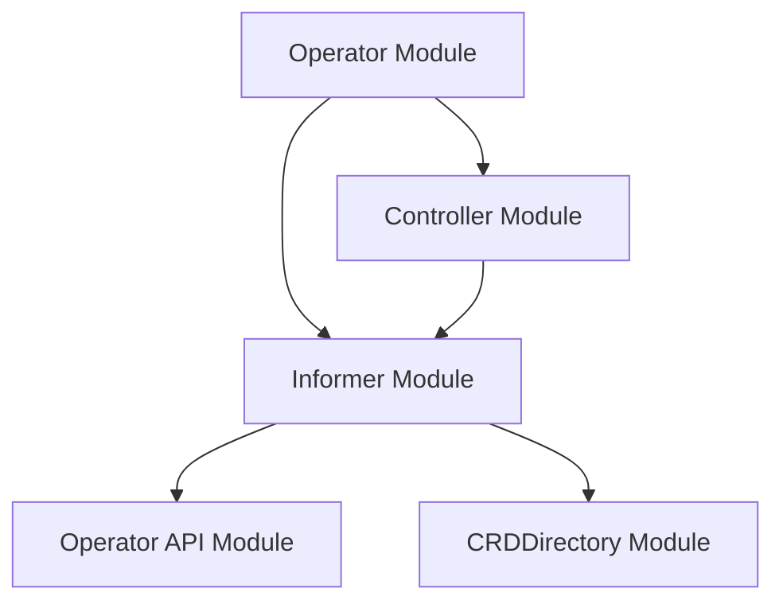

# Informer Module Documentation

## Introduction and Purpose

The `informer` module, located at `operator/internal/informer`, is a critical component within the `operator` system responsible for watching and reacting to changes in Kubernetes resources. It provides the mechanism for the operator to stay informed about the desired state of custom resources (CRDs) and other Kubernetes objects, enabling it to reconcile and maintain the system's overall health and functionality. This module leverages Kubernetes informers to efficiently observe resource events (additions, updates, deletions) without constantly polling the API server.

## Architecture Overview

The `informer` module is a core internal component of the `operator`, facilitating communication and event-driven reactions within the control loop. It interacts closely with the `controller` module by providing updated object information, and potentially uses definitions from `operator_api` for CRD types. The `crddirectory` module might be used to retrieve CRD definitions for the informer to watch.

## High-Level Functionality

The `informer` module's primary function is to establish and manage watches on Kubernetes resources. When an event occurs for a watched resource, the informer triggers registered handlers, which typically inform the main `controller` about the change, prompting a reconciliation loop. This event-driven approach ensures the operator reacts promptly to changes in the cluster.

### Core Components

The `informer` module includes the following key components:

*   **`RequestWatch`**: Defines the parameters for setting up a watch on a Kubernetes resource.
*   **`KeyParams`**: Provides a structured way to identify specific Kubernetes resources.

## Detailed Component Descriptions

### `RequestWatch`

The `RequestWatch` struct (`operator.internal.informer.informer.RequestWatch`) encapsulates all necessary information to set up a watch on a particular Kubernetes resource. This includes:

*   **`Req`**: A `ctrl.Request` object, commonly used in controller-runtime for identifying a reconciliation request.
*   **`ResourceName`**: The name of the resource to watch.
*   **`ResourceNamespace`**: The namespace of the resource to watch.
*   **`GroupVersionResource`**: A `schema.GroupVersionResource` object specifying the API group, version, and resource type (e.g., `apps/v1/deployments`). This is crucial for dynamically watching different types of Kubernetes objects, including Custom Resources.
*   **`Handlers`**: A `cache.ResourceEventHandlerFuncs` set of functions that define the actions to be taken when an object is added, updated, or deleted. These handlers are the entry points for the controller to react to changes.

This structure allows the `informer` to be highly flexible, capable of watching various resources with specific event handling logic.

### `KeyParams`

The `KeyParams` struct (`operator.internal.informer.informer.KeyParams`) is used to uniquely identify a Kubernetes resource within the system. It consists of the following fields:

*   **`Namespace`**: The namespace where the resource resides.
*   **`CRDName`**: The name of the Custom Resource Definition (CRD) if the resource is a custom resource.
*   **`ResourceType`**: The general type of the resource (e.g., "Deployment", "ElastiService").
*   **`ResourceName`**: The specific name of the resource instance.

`KeyParams` provides a standardized way to reference objects, which is essential for consistent lookup and management across different parts of the operator, especially when processing events from informers.
