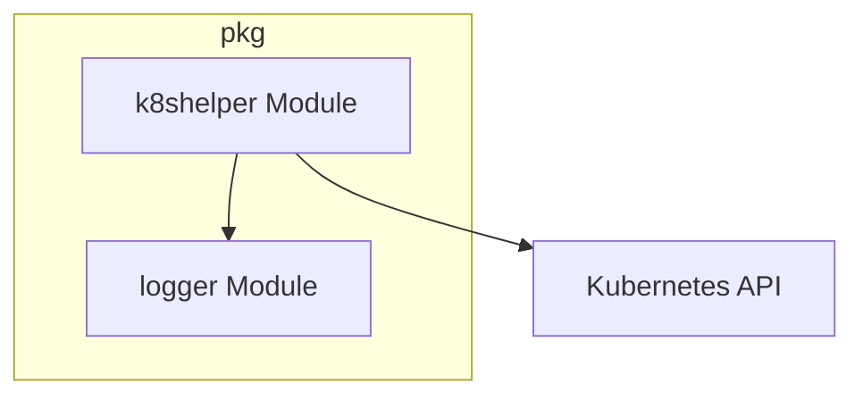

# k8shelper Module Documentation

## Introduction

The `k8shelper` module, located within the `pkg` package, provides essential utilities for interacting with a Kubernetes cluster. It centralizes Kubernetes client operations, offering a standardized way for other modules to perform Kubernetes API calls and manage resources.

## Core Functionality

The primary component of this module is the `Ops` struct, which encapsulates the necessary clients and logging capabilities for Kubernetes interactions.

### pkg.k8shelper.ops.Ops

The `Ops` struct is designed to hold instances of Kubernetes API clients and a logger:

```go
type Ops struct {
	kClient        *kubernetes.Clientset
	kDynamicClient *dynamic.DynamicClient
	logger         *zap.Logger
}
```

-   `kClient`: An instance of `*kubernetes.Clientset` used for interacting with standard Kubernetes resources (e.g., Pods, Deployments, Services) using their Go client representations.
-   `kDynamicClient`: An instance of `*dynamic.DynamicClient` which allows interaction with Kubernetes resources whose types may not be known at compile time, or for custom resources (CRDs). This client provides a generic interface for CRUD operations on any API resource.
-   `logger`: A `*zap.Logger` instance, providing efficient structured logging for operations performed by the `k8shelper` module. This ensures that all Kubernetes interactions are properly logged for debugging and auditing purposes.

## Architecture and Component Relationships

The `k8shelper` module acts as a foundational layer for Kubernetes communication within the system. It provides a shared interface for other modules that need to interact with the Kubernetes API.



## How the Module Fits into the Overall System

The `k8shelper` module is a crucial utility within the `pkg` package, enabling other components like `scaling`, `resolver`, and `operator` to interact seamlessly with the Kubernetes control plane. By abstracting the complexities of Kubernetes client initialization and common operations, `k8shelper` promotes reusability and maintains consistency in how Kubernetes resources are managed across the application. For instance, the `operator` module might use `k8shelper` to manage `ElastiService` custom resources, while the `scaling` module could use it to fetch metrics or scale target resources.

It depends on the `logger` module for logging capabilities, ensuring that all Kubernetes-related activities are properly recorded.