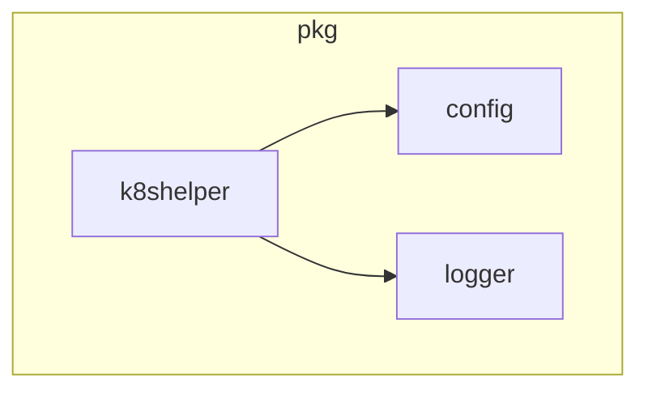

# k8shelper Module Documentation

## Introduction
The `k8shelper` module provides a set of utility functions and structures for interacting with the Kubernetes API. It acts as a central point for managing Kubernetes clients and performing common operations within the cluster, supporting both standard Kubernetes resources and custom resources (CRDs).

## Core Functionality

The primary component of the `k8shelper` module is the `Ops` struct:

### `Ops` Struct
The `Ops` struct encapsulates Kubernetes client instances and a logger, making it convenient to perform various Kubernetes operations throughout the application.

```go
type Ops struct {
	kClient        *kubernetes.Clientset
	kDynamicClient *dynamic.DynamicClient
	logger         *zap.Logger
}
```

**Fields:**
*   `kClient`: A standard Kubernetes client used for interacting with built-in Kubernetes resources (e.g., Pods, Deployments, Services).
*   `kDynamicClient`: A dynamic Kubernetes client used for interacting with custom resources (CRDs) where the GVK (Group, Version, Kind) might not be known at compile time or for more generic resource manipulation.
*   `logger`: An instance of a Zap logger, used for logging operations and events within the `k8shelper` module.

## Architecture

The `k8shelper` module serves as an essential utility layer, abstracting direct Kubernetes API interactions. It depends on `pkg.logger` for all its logging needs and likely relies on `pkg.config` for obtaining the necessary Kubernetes client configurations.



## Integration with the Overall System
The `k8shelper` module is fundamental for any part of the system that needs to interact with the Kubernetes cluster. Components like `operator` and `resolver` would typically initialize an `Ops` instance and use its methods to:
*   Create, read, update, and delete Kubernetes resources.
*   Watch for changes in Kubernetes resources.
*   Manage custom resources defined by the operator.

By centralizing Kubernetes client management, `k8shelper` ensures consistent interaction with the cluster and simplifies resource management for other modules.
