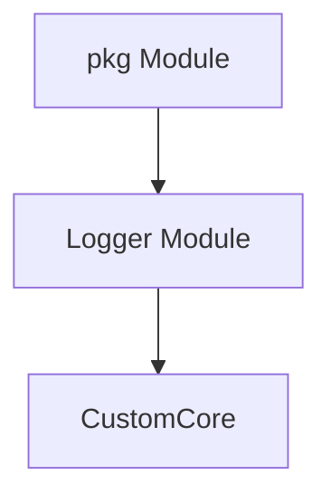

# Logger Module Documentation

## Introduction

The `logger` module, located within the `pkg` package, provides custom logging functionalities for the system. It leverages the `zapcore` library to offer a flexible and efficient logging core, allowing for tailored logging configurations across various components of the application. This module acts as a wrapper to extend or customize the default `zapcore.Core` capabilities.

## Architecture and Component Relationships

### Core Components

#### `pkg.logger.logger.CustomCore`

The `CustomCore` struct is the primary component of the `logger` module. It embeds `zapcore.Core`, allowing it to inherit all the functionalities of a standard `zapcore.Core` while also providing a point for future extensions or customizations specific to the application's logging requirements.

```go
type CustomCore struct {
	zapcore.Core
}
```

### Module Architecture Diagram



## How the Module Fits into the Overall System

The `logger` module is an integral part of the `pkg` package, providing a standardized and configurable logging mechanism. It is designed to be utilized by other components within the `pkg` module and potentially other top-level modules like `resolver` and `operator` for consistent log generation. By wrapping `zapcore.Core`, it ensures high-performance logging while maintaining the flexibility to introduce custom logging behaviors, output formats, or integration with external logging services as needed by the application. This centralizes logging configuration and promotes reusability across the codebase.