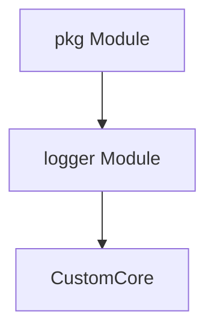

# logger Module Documentation

## Introduction
The `logger` module is a core utility within the `pkg` package, providing custom logging functionalities for the system. It leverages the `zap` logging library, extending its capabilities through the `CustomCore` component to offer a tailored logging solution. This module ensures that all other components within the system have a consistent and efficient way to record events, debug information, and errors.

## Architecture and Component Relationships

The `logger` module is designed to be a foundational service, utilized by various other modules within the `pkg` package and potentially other parts of the system for robust logging.



### Components

#### CustomCore
The `CustomCore` component is the primary structure within the `logger` module. It is a Go struct that embeds `zapcore.Core`, which is a fundamental interface from the `zap` logging library.
```go
type CustomCore struct {
	zapcore.Core
}
```
By embedding `zapcore.Core`, `CustomCore` inherently gains all the functionalities of the `zap` core logger. This design pattern allows the `logger` module to extend or customize `zap`'s behavior without rewriting its core logic. It provides a flexible way to implement custom logging levels, output formats, or hooks for specific application requirements while maintaining compatibility with the high-performance `zap` logger.

## How the Module Fits into the Overall System

The `logger` module, specifically through its `CustomCore` component, acts as the central logging mechanism for the entire system. Its integration into the `pkg` module signifies its role as a common utility, available to all sub-modules within `pkg` such as `config`, `scaling`, `messages`, and `k8shelper`. By providing a unified and customizable logging interface, the `logger` module helps in:
*   **Centralized Logging:** Ensuring that all system components log their activities through a consistent mechanism.
*   **Debuggability and Observability:** Facilitating easier debugging and monitoring of the application's behavior in various environments.
*   **Performance:** Leveraging the high-performance characteristics of the `zap` library for efficient log processing.

This module is crucial for maintaining system health, troubleshooting issues, and gaining insights into the application's operational dynamics.