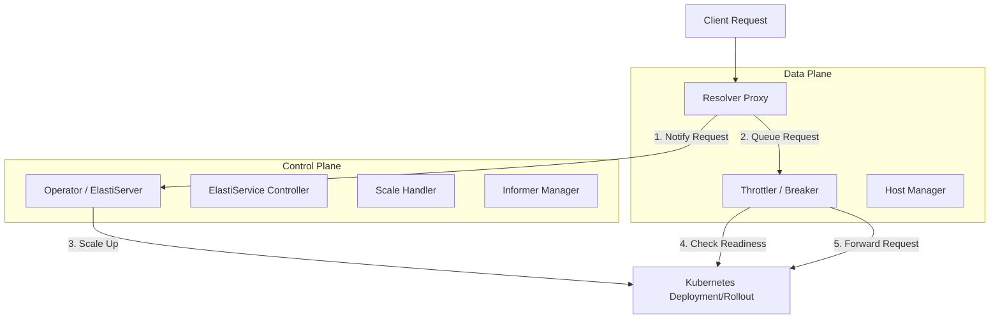

# Elasti System Documentation

## Overview
Elasti is a Kubernetes-native autoscaling solution designed to provide "scale-to-zero" capabilities for any service. It consists of two primary components: the **Resolver** and the **Operator**.

The system works by intercepting traffic via the Resolver (acting as a reverse proxy). When a request arrives for a service that is currently scaled to zero, the Resolver queues the request and notifies the Operator. The Operator then scales up the target service. Once the service is ready, the Resolver forwards the queued requests.

## Architecture

## Core Modules

### [Resolver](resolver.md)
The Resolver is the data plane component. It acts as a high-performance reverse proxy that:
- Identifies the target service based on incoming headers.
- Manages request queuing and concurrency limits using a circuit breaker pattern.
- Communicates with the Operator to trigger scale-up events.
- Monitors service endpoint readiness before forwarding traffic.

### [Operator](operator.md)
The Operator is the control plane component. It manages the lifecycle of `ElastiService` resources and:
- Reconciles `ElastiService` CRDs.
- Watches target resources (Deployments, Rollouts) via Kubernetes Informers.
- Provides an internal API (`ElastiServer`) for the Resolver to report incoming traffic.
- Executes scaling logic based on metrics (e.g., Prometheus) or manual triggers.

### [Shared Packages (pkg)](pkg.md)
Common utilities used by both Resolver and Operator, including:
- **Scaling**: Logic for different scalers (e.g., Prometheus) and the core scale handler.
- **Config**: Environment-based configuration management.
- **K8sHelper**: Simplified Kubernetes API interactions.
- **Logger**: Structured logging with Sentry integration.

## Key Workflows

### Request Handling & Scale-from-Zero
1. A request hits the Resolver.
2. `HostManager` determines the target namespace and service.
3. Resolver sends an RPC to the Operator's `ElastiServer`.
4. `Throttler` enters a "Try" loop:
    - It checks if the target service has active endpoints.
    - If not, it waits and retries (queuing the request).
5. Operator receives the RPC, looks up the `ElastiService` spec, and scales the target resource to the minimum replicas.
6. Once Kubernetes starts the pods and endpoints become active, the Resolver's `Throttler` detects readiness.
7. The request is proxied to the target service.

### Scale-to-Zero (Cooldown)
1. The `ScaleHandler` in the Operator periodically polls active `ElastiServices`.
2. It checks configured triggers (e.g., Prometheus queries).
3. If triggers indicate the service is idle and the `CooldownPeriod` has elapsed, the `ScaleHandler` scales the target resource to zero.
4. The system switches to "Proxy Mode", where the Resolver will again intercept and queue future requests.
