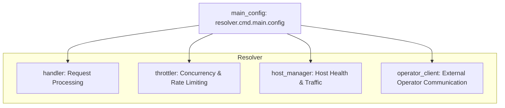

# `main_config` Module Documentation

## Introduction
The `main_config` module, specifically the `resolver.cmd.main.config` component, defines the core configuration parameters for the `resolver` service. These parameters govern critical aspects such as connection pooling, request timeouts, traffic management, queuing behavior, and integration with external services like Sentry. This module serves as the central point for tuning the operational characteristics of the resolver.

## Core Functionality
The `resolver.cmd.main.config` struct encapsulates a wide range of configurable options that dictate the behavior of the `resolver` application. Each field within this struct allows operators and developers to fine-tune specific functionalities.

### `config` Struct (resolver.cmd.main.config)
```go
type config struct {
	MaxIdleProxyConns        int `split_words:"true" default:"1000"`
	MaxIdleProxyConnsPerHost int `split_words:"true" default:"100"`
	ReqTimeout               int `split_words:"true" default:"600"`
	TrafficReEnableDuration  int `split_words:"true" default:"30"`
	OperatorRetryDuration    int `split_words:"true" default:"30"`
	QueueRetryDuration       int `split_words:"true" default:"5"`
	QueueSize                int `split_words:"true" default:"100"`
	MaxQueueConcurrency      int `split_words:"true" default:"10"`
	InitialCapacity          int `split_words:"true" default:"100"`
	HeaderForHost            string `split_words:"true" default:"Host"`
	SentryDsn                string `split_words:"true" default:""`
	SentryEnv                string `envconfig:"SENTRY_ENVIRONMENT" default:""`
	EnableH2C                bool `envconfig:"ENABLE_H2C" default:"false"`
}
```

**Key Configuration Parameters:**
*   **Connection Management**:
    *   `MaxIdleProxyConns`: Total maximum idle proxy connections.
    *   `MaxIdleProxyConnsPerHost`: Maximum idle proxy connections allowed per host.
*   **Request Handling**:
    *   `ReqTimeout`: Timeout in seconds for individual requests.
    *   `HeaderForHost`: Specifies the HTTP header used to identify the target host for a request.
*   **Traffic and Host Management**:
    *   `TrafficReEnableDuration`: The duration (in seconds) for which traffic is disabled for a host after an issue, and also the period before re-checking the host's readiness.
    *   `OperatorRetryDuration`: The duration (in seconds) to wait before informing the operator again about traffic conditions on the same host, preventing excessive notifications.
*   **Queuing and Concurrency**:
    *   `QueueSize`: The maximum number of requests that can be held in the internal queue.
    *   `QueueRetryDuration`: The duration (in seconds) after which queued requests are retried.
    *   `MaxQueueConcurrency`: The maximum number of requests that can be processed concurrently from the queue.
    *   `InitialCapacity`: The initial capacity for the semaphore used for controlling concurrency, typically for the throttler.
*   **Observability**:
    *   `SentryDsn`, `SentryEnv`: Configuration for Sentry error reporting and environment identification.
*   **Protocol Support**:
    *   `EnableH2C`: A boolean flag to enable HTTP/2 Cleartext (H2C) support.

## Architecture and Component Relationships

The `config` struct is a foundational component that is consumed by various modules within the `resolver` to initialize and control their behavior. It acts as a central repository for system-wide settings.



*   **`handler` Module**: Utilizes parameters like `ReqTimeout`, `QueueSize`, `QueueRetryDuration`, `MaxQueueConcurrency`, and `HeaderForHost` to manage incoming requests, queueing, and response handling.
*   **`throttler` Module**: Leverages `InitialCapacity` to configure semaphores and potentially other rate-limiting mechanisms, and indirectly uses `QueueSize` and `MaxQueueConcurrency` to manage the overall request flow.
*   **`host_manager` Module**: Relies on `TrafficReEnableDuration` to control how long hosts are considered unhealthy and when to re-check their status.
*   **`operator_client` Module**: Uses `OperatorRetryDuration` to manage the frequency of communication with an external operator, preventing notification storms.

## How the Module Fits into the Overall System

The `main_config` module is integral to the entire `resolver` system as it provides the necessary parameters to configure the resolver's operational behavior. By centralizing these settings, it ensures consistency and ease of management across different components.

The `resolver` acts as a crucial intermediary service, and its configuration directly impacts its ability to efficiently route and manage traffic, handle host failures, and communicate with the `operator`. For instance, `QueueSize` and `MaxQueueConcurrency` are vital for the resolver's resilience under load, while `TrafficReEnableDuration` and `OperatorRetryDuration` are key for its adaptive capabilities in dynamic environments, integrating with the larger system orchestrated by the `operator` module.
