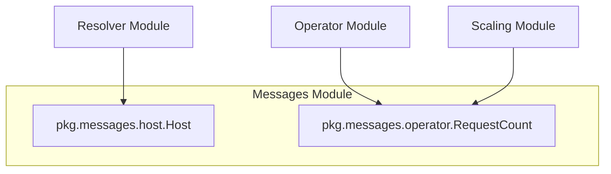

# Messages Module Documentation

## Introduction

The `messages` module (`pkg/messages`) serves as a foundational component within the system, defining the core data structures used for inter-module communication. It encapsulates well-defined message formats for critical operational data, such as host information and request counts. By centralizing these definitions, the module ensures consistency and clarity in data exchange across various system components, promoting loose coupling and maintainability.

## Core Components

### `pkg.messages.host.Host`

The `Host` struct represents detailed information about a host involved in network traffic or service interactions. It captures attributes essential for traffic management, routing, and operational insights.

```go
type Host struct {
	IncomingHost   string
	Namespace      string
	SourceService  string
	TargetService  string
	SourceHost     string
	TargetHost     string
	TrafficAllowed bool
}
```

**Fields:**

*   `IncomingHost`: The hostname of the incoming request.
*   `Namespace`: The Kubernetes namespace where the services operate.
*   `SourceService`: The name of the service initiating the traffic.
*   `TargetService`: The name of the service intended to receive the traffic.
*   `SourceHost`: The actual host from which the traffic originates.
*   `TargetHost`: The actual host to which the traffic is directed.
*   `TrafficAllowed`: A boolean flag indicating whether the traffic flow is permitted.

### `pkg.messages.operator.RequestCount`

The `RequestCount` struct is used to aggregate and communicate the number of requests for a specific service within a given namespace. This data is crucial for monitoring service load and informing autoscaling decisions.

```go
type RequestCount struct {
	Count     int    `json:"count"`
	Svc       string `json:"svc"`
	Namespace string `json:"namespace"`
}
```

**Fields:**

*   `Count`: The total number of requests.
*   `Svc`: The name of the service associated with the request count.
*   `Namespace`: The Kubernetes namespace of the service.

## Architecture and Component Relationships

The `messages` module provides the data contracts that facilitate communication between different parts of the system. Its structs are consumed by modules responsible for traffic resolution, host management, and operational scaling.



## How it Fits into the Overall System

The `messages` module plays a vital role by defining the common language for data exchange across the system. It acts as a shared vocabulary, ensuring that different components interpret and process information consistently.

*   **Host Management:** The `Host` message structure is fundamental for the `resolver` module, particularly for components like `resolver.internal.hostmanager.hostManager.HostManager` and `resolver.internal.handler.handler.HostManager`, to track and manage the state and traffic flow of individual hosts. It enables intelligent routing and access control decisions.

*   **Operational Scaling:** The `RequestCount` message structure is critical for the `operator` and `scaling` modules. The `operator` uses this information, potentially via `operator.internal.controller.elastiservice_controller.ElastiServiceReconciler` or `operator.internal.informer.informer.RequestWatch`, to monitor service load. This data then feeds into the `scaling` module (e.g., `pkg.scaling.scalers.prometheus_scaler.prometheusScaler`) to make informed, dynamic autoscaling decisions, ensuring that services can adapt to varying demand efficiently.