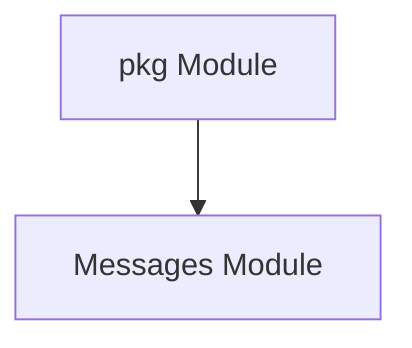

# Messages Module Documentation

## Introduction
The `messages` module defines core data structures used for inter-service communication and management within the system. It provides essential message formats for representing host information and request counts, facilitating clear and standardized data exchange between different components, particularly within the `pkg` module.

## Core Components

### Host
The `Host` struct encapsulates detailed information about a network host, including its origin, destination, and various service-related identifiers. This structure is crucial for routing, access control, and understanding traffic flow within the application.

```go
type Host struct {
	IncomingHost   string
	Namespace      string
	SourceService  string
	TargetService  string
	SourceHost     string
	TargetHost     string
	TrafficAllowed bool
}
```

- **IncomingHost**: The hostname or IP address from which a request originates.
- **Namespace**: The Kubernetes namespace associated with the services.
- **SourceService**: The name of the service initiating the request.
- **TargetService**: The name of the service intended to receive the request.
- **SourceHost**: The specific host within the source service.
- **TargetHost**: The specific host within the target service.
- **TrafficAllowed**: A boolean indicating whether traffic is permitted between the source and target.

### RequestCount
The `RequestCount` struct is used to aggregate and report the number of requests for a particular service within a specific namespace. This is vital for monitoring, autoscaling, and load balancing decisions.

```go
type RequestCount struct {
	Count     int    `json:"count"`
	Svc       string `json:"svc"`
	Namespace string `json:"namespace"`
}
```

- **Count**: The total number of requests.
- **Svc**: The name of the service to which the request count applies.
- **Namespace**: The Kubernetes namespace of the service.

## Architecture
The `messages` module is a fundamental part of the `pkg` module, providing basic data structures that are consumed by other `pkg` sub-modules and potentially other top-level modules like `operator` and `resolver` for communication and data representation.



## Relationships to Other Modules
The `messages` module primarily serves as a dependency for other modules that require standardized data structures for inter-process communication. It is a key component within the `pkg` module, and its definitions are used by:
- **`pkg` module**: For general utilities and core functionalities.
- **`operator` module**: Potentially uses `RequestCount` to inform scaling decisions or `Host` for managing service interactions.
- **`resolver` module**: Might use `Host` to determine routing or `RequestCount` for load balancing.

For more information on the overarching `pkg` module, refer to [pkg.md](pkg.md).
