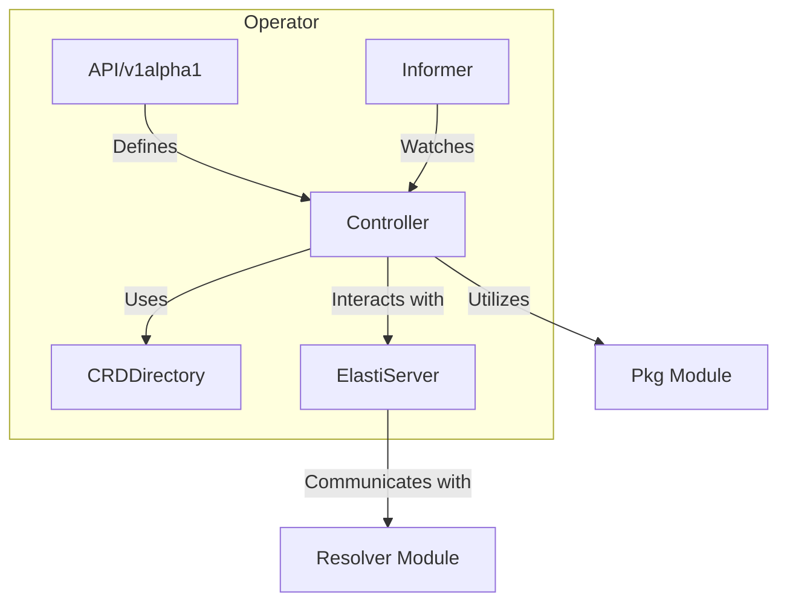

# Operator Module Documentation

## Introduction
The `operator` module is a core component responsible for managing and orchestrating `ElastiService` custom resources within a Kubernetes cluster. It handles the lifecycle of these custom resources, including watching for changes, reconciling states, and interacting with other system components like the `resolver` and `pkg` modules for scaling operations.

## Architecture Overview
The `operator` module is structured into several internal packages, each with specific responsibilities. The core of the operator involves defining `ElastiService` custom resource definitions (CRDs), watching for resource changes using informers, reconciling the desired state with the actual state, maintaining a directory of CRD information, and exposing an API for internal communication.

## Sub-modules and their Functionality

### API/v1alpha1 ([api_v1alpha1.md](api_v1alpha1.md))
This sub-module defines the Custom Resource Definitions (CRDs) for `ElastiService`. It includes the schema for `ElastiService` objects, `ElastiServiceSpec`, `ElastiServiceStatus`, `ScaleTargetRef`, `ScaleTrigger`, and `AutoscalerSpec`. These definitions are crucial for Kubernetes to understand and manage `ElastiService` resources.

### Informer ([informer.md](informer.md))
The `informer` sub-module is responsible for setting up and managing Kubernetes informers. Informers are essential for efficiently watching for changes in Kubernetes resources, allowing the operator to react to create, update, and delete events for `ElastiService` objects and their related resources.

### Controller ([controller.md](controller.md))
The `controller` sub-module contains the core reconciliation logic for `ElastiService` resources. The `ElastiServiceReconciler` is responsible for observing the current state of the cluster, comparing it with the desired state specified in `ElastiService` objects, and taking actions to bring the actual state in line with the desired state, including scaling operations.

### CRDDirectory ([crddirectory.md](crddirectory.md))
The `crddirectory` sub-module manages a directory of `ElastiService` CRD details. It provides a centralized way to access and manage information about the custom resources being handled by the operator.

### ElastiServer ([elastiserver.md](elastiserver.md))
The `elastiserver` sub-module acts as an internal communication server. It receives events, typically from the `resolver` module, indicating requests for services. Upon receiving such events, it triggers scaling actions for the target resources managed by `ElastiService` objects, particularly scaling up services that are currently at zero replicas.
