# Operator Module Documentation

## Introduction

The `operator` module is a critical component of the system, responsible for managing the lifecycle and scaling of `ElastiService` custom resources within a Kubernetes environment. It acts as a Kubernetes operator, defining the API for `ElastiService` objects, watching for changes to these resources, and performing reconciliation logic to ensure the desired state of the services. This module integrates deeply with Kubernetes to provide automated scaling and management capabilities for applications.

## Architecture

```mermaid
graph TD
    operator[Operator Module]

    subgraph API
        operator_api[API Definitions]
        elastiservice_types[ElastiService Types]
    end

    subgraph Control Plane
        operator_controller[Controller Logic]
        elastiservice_reconciler[ElastiService Reconciler]
        obj_info_updater[Object Info Updater]
    end

    subgraph Watchers
        operator_informer[Informer]
        request_watch[Request Watch]
        key_params[Key Parameters]
    end

    subgraph CRD Management
        operator_crddirectory[CRD Directory]
        crd_details[CRD Details]
        directory[Directory]
    end

    subgraph API Server
        operator_elastiserver[ElastiServer]
        server[HTTP Server]
    end

    operator_api --> elastiservice_types
    operator_controller --> elastiservice_reconciler
    operator_controller --> obj_info_updater
    operator_informer --> request_watch
    operator_informer --> key_params
    operator_crddirectory --> crd_details
    operator_crddirectory --> directory
    operator_elastiserver --> server

    operator --> operator_api
    operator --> operator_controller
    operator --> operator_informer
    operator --> operator_crddirectory
    operator --> operator_elastiserver

    elastiservice_reconciler --> elastiservice_types
    elastiservice_reconciler --> request_watch
    elastiservice_reconciler --> crd_details

    resolver_client[RPC Client]
    resolver[Resolver Module]

    resolver_client -- communicates with --> server
    resolver -- uses --> resolver_client

    operator --- resolver_client
    operator --- resolver

    pkg[Common Utilities]
    operator --> pkg

    click operator_api "operator_api.md" "View Operator API Module"
    click operator_controller "operator_controller.md" "View Operator Controller Module"
    click operator_informer "operator_informer.md" "View Operator Informer Module"
    click operator_crddirectory "operator_crddirectory.md" "View Operator CRD Directory Module"
    click operator_elastiserver "operator_elastiserver.md" "View Operator ElastiServer Module"
    click resolver "resolver.md" "View Resolver Module"
    click pkg "pkg.md" "View Pkg Module"
```

## Core Components and Functionality

### `operator.api.v1alpha1.elastiservice_types`
This package defines the Custom Resource Definition (CRD) for `ElastiService` objects. It includes:
- `ElastiService`: The primary CRD object, encapsulating the desired state of a scalable service.
- `ElastiServiceSpec`: Defines the specification of an `ElastiService`, including details about the target application, scaling behavior, and triggers.
- `ElastiServiceStatus`: Represents the current observed state of an `ElastiService`.
- `AutoscalerSpec`: Configuration for the autoscaling behavior.
- `ScaleTargetRef`: Reference to the Kubernetes resource that needs to be scaled.
- `ScaleTrigger`: Defines the conditions or metrics that trigger scaling actions.
- `ElastiServiceList`: A list type for `ElastiService` resources, used for API operations.

### `operator.internal.controller.elastiservice_controller.ElastiServiceReconciler`
This is the core reconciliation logic for `ElastiService` resources. The `ElastiServiceReconciler` watches for changes to `ElastiService` objects and ensures that the actual state of the system matches the desired state defined in the `ElastiService` spec. It interacts with the Kubernetes API to manage deployments, services, and other related resources.

### `operator.internal.informer.informer.RequestWatch` and `operator.internal.informer.informer.KeyParams`
These components are part of the informer mechanism, responsible for watching Kubernetes resources and providing notifications about changes. `RequestWatch` likely sets up watches on specific resources, while `KeyParams` might be used to extract relevant identifying information (keys) from watched objects for processing.

### `operator.internal.crddirectory.directory.CRDDetails` and `operator.internal.crddirectory.directory.Directory`
These components manage Custom Resource Definitions (CRDs). The `Directory` likely maintains a registry of CRDs known to the operator, and `CRDDetails` would hold metadata and schema information for each CRD. This ensures the operator can correctly interpret and validate `ElastiService` resources.

### `operator.internal.elastiserver.elastiServer.Server`
This component represents an HTTP server within the operator. It likely exposes endpoints for other parts of the system (such as the `resolver` module) to communicate with the `operator`, possibly to query status or provide input for scaling decisions. The `resolver.internal.operator.RPCClient.Client` component in the `resolver` module would be used to interact with this server.

### `operator.internal.controller.opsInformer.updateObjInfo`
This component is likely responsible for updating object information within the operator's internal cache or state management, ensuring that the controller has the most up-to-date view of the Kubernetes resources it manages.

## Integration with the Overall System

The `operator` module plays a central role in the system's ability to manage and scale services dynamically. It acts as the primary interface for defining and controlling scalable applications through `ElastiService` custom resources. 

It integrates with the `resolver` module, which uses an `RPCClient` to communicate with the `operator`'s `ElastiServer`. This communication allows the `resolver` to query the `operator` for information or trigger actions, potentially influencing scaling decisions based on real-time traffic or load. The `pkg` module provides common utilities and helper functions used across both `operator` and `resolver` modules, ensuring consistency and reusability.
