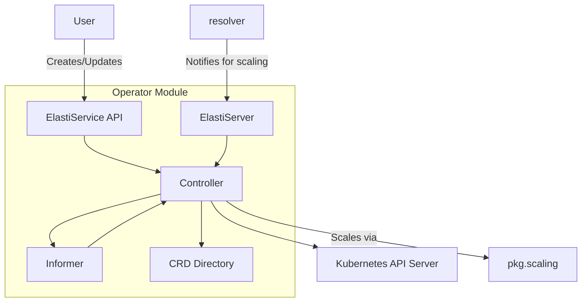

# Operator Module Documentation

## Introduction

The `operator` module is a core component responsible for managing and orchestrating the scaling of services within a Kubernetes environment. It introduces the `ElastiService` Custom Resource Definition (CRD), allowing users to define how their services should scale dynamically based on various triggers. The operator watches for changes to `ElastiService` resources, reconciles the desired state with the actual cluster state, and interacts with other components like the `resolver` and external autoscalers (e.g., HPA, KEDA) to achieve intelligent scaling.

## Architecture Overview

The `operator` module follows a standard Kubernetes operator pattern, extending the Kubernetes API with custom resources and implementing a control loop to manage them. It integrates with the `pkg` module for common utilities like scaling logic, message handling, and configuration, and interacts with the `resolver` module for service request events.

## Sub-modules and their Functionality

The `operator` module is composed of several key sub-modules, each with distinct responsibilities:

*   **[API](api.md)**: Defines the custom resource definitions (CRDs) for `ElastiService`, including its specifications (`ElastiServiceSpec`), status (`ElastiServiceStatus`), and various related types like `ScaleTargetRef` and `ScaleTrigger`.
*   **[ElastiServer](elastiserver.md)**: Provides an endpoint for other components, such as the [resolver](resolver.md) module, to communicate scaling-related events to the operator. This allows the operator to react to real-time service requests.
*   **[CRD Directory](crddirectory.md)**: Manages and provides access to the details of the `ElastiService` custom resources, effectively acting as a cache or directory for currently configured `ElastiService` instances.
*   **[Informer](informer.md)**: Responsible for watching Kubernetes resources, including `ElastiService` instances and their target resources (e.g., Deployments, Rollouts). It informs the controller about changes, additions, or deletions of these resources.
*   **[Controller](controller.md)**: The core reconciliation logic of the operator. It receives events from the informer, compares the desired state (defined by `ElastiService` resources) with the actual cluster state, and takes actions to bring them into alignment, primarily involving scaling operations through the [pkg.scaling](scaling.md) module.
