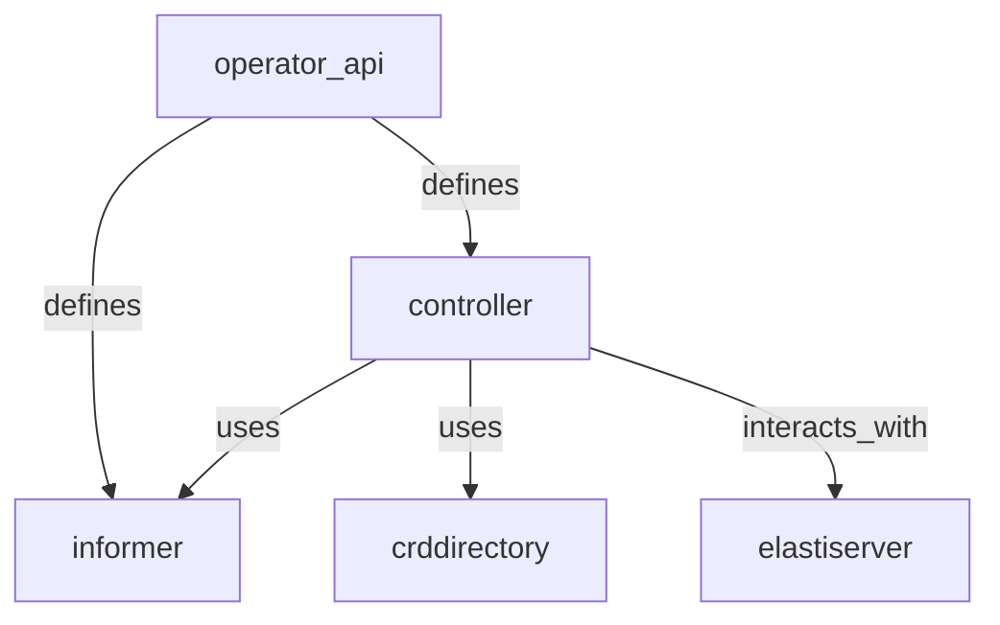
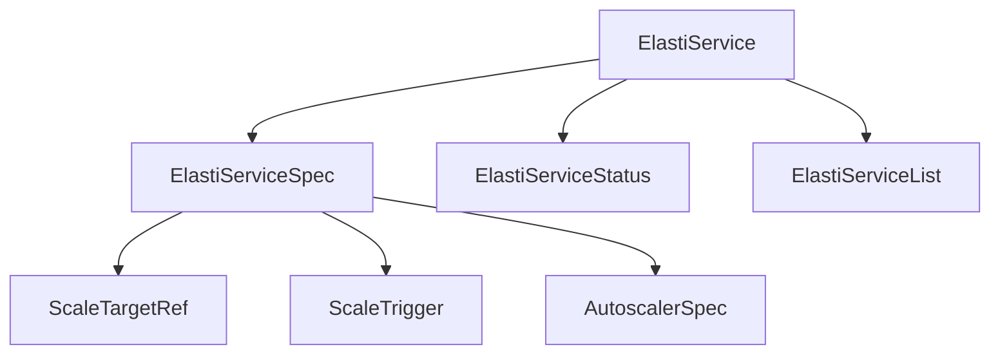

# operator_api Module Documentation

## Introduction
The `operator_api` module defines the Custom Resource Definitions (CRDs) for the ElastiService. These CRDs are crucial for extending Kubernetes with custom resources that the ElastiService operator can manage. It provides the Go structs that represent the desired state (`ElastiServiceSpec`) and observed status (`ElastiServiceStatus`) of an ElastiService, along with supporting types like `ScaleTargetRef`, `ScaleTrigger`, and `AutoscalerSpec`.

This module serves as the contract between users and the ElastiService operator, allowing users to declare their scaling intentions and the operator to reconcile the actual state with the desired state.

## Overall Operator Module Architecture

The `operator` module is composed of several key sub-modules that work together to manage `ElastiService` resources. The `operator_api` module, which is the focus of this document, defines the foundational API types that other modules consume.



## operator_api Module Components

The `operator_api` module specifically focuses on defining the Custom Resource Definitions (CRDs) for the ElastiService. The following diagram illustrates the relationships between these core types within the `operator_api` module:



This module consists of the following key Go types, all defined in `operator/api/v1alpha1/elastiservice_types.go`:

### ElastiService
The `ElastiService` is the top-level Custom Resource Definition (CRD) for managing elastic scaling. It encapsulates the desired specification (`ElastiServiceSpec`) and the observed status (`ElastiServiceStatus`) of a scalable target.

```go
type ElastiService struct {
        metav1.TypeMeta   `json:",inline"`
        metav1.ObjectMeta `json:"metadata,omitempty"`

        Spec   ElastiServiceSpec   `json:"spec,omitempty"`
        Status ElastiServiceStatus `json:"status,omitempty"`
}
```

### ElastiServiceSpec
The `ElastiServiceSpec` defines the desired state and configuration for an `ElastiService`. It specifies what resource to scale, scaling parameters, and the triggers that initiate scaling actions.

```go
type ElastiServiceSpec struct {
        // ScaleTargetRef of the target resource to scale
        ScaleTargetRef ScaleTargetRef `json:"scaleTargetRef"`
        // Service to scale
        Service string `json:"service"`
        // Minimum number of replicas to scale to
        // +kubebuilder:validation:Minimum=1
        MinTargetReplicas int32 `json:"minTargetReplicas,omitempty" default:"1"`
        // Cooldown period in seconds.
        // It tells how long a target resource can be idle before scaling it down
        // +kubebuilder:validation:Minimum=0
        // +kubebuilder:validation:Maximum=604800
        // +kubebuilder:default=900
        CooldownPeriod int32 `json:"cooldownPeriod,omitempty"`
        // Triggers to scale the target resource
        // +kubebuilder:validation:MinItems=1
        Triggers   []ScaleTrigger  `json:"triggers,omitempty"`
        Autoscaler *AutoscalerSpec `json:"autoscaler,omitempty"`
}
```

### ElastiServiceStatus
The `ElastiServiceStatus` represents the observed status of the `ElastiService` resource. It provides information about the last reconciliation time, last scaled-up time, and the current operational mode of the ElastiService.

```go
type ElastiServiceStatus struct {
        // Last time the ElastiService was reconciled
        LastReconciledTime metav1.Time `json:"lastReconciledTime,omitempty"`
        // Last time the ElastiService was scaled up
        LastScaledUpTime *metav1.Time `json:"lastScaledUpTime,omitempty"`
        // Current mode of the ElastiService, either "proxy" or "serve".
        // "proxy" mode is when the ScaleTargetRef is scaled to 0 replicas.
        // "serve" mode is when the ScaleTargetRef is scaled to at least 1 replica.
        Mode string `json:"mode,omitempty"`
}
```

### ScaleTargetRef
`ScaleTargetRef` identifies the Kubernetes resource that the ElastiService operator should scale. This typically includes Deployments or Rollouts.

```go
type ScaleTargetRef struct {
        // API version of the target resource
        // +kubebuilder:validation:Enum=apps/v1;argoproj.io/v1alpha1
        APIVersion string `json:"apiVersion"`
        // Kind of the target resource
        // +kubebuilder:validation:Enum=deployments;rollouts;Deployment;StatefulSet;Rollout
        Kind string `json:"kind"`
        // Name of the target resource
        Name string `json:"name"`
}
```

### AutoscalerSpec
`AutoscalerSpec` defines the external autoscaler that will manage the scaling of the target resource. Currently supports HPA (Horizontal Pod Autoscaler) and KEDA (Kubernetes Event-driven Autoscaling).

```go
type AutoscalerSpec struct {
        // +kubebuilder:validation:Enum=hpa;keda
        Type string `json:"type"`
        Name string `json:"name"`
}
```

### ScaleTrigger
`ScaleTrigger` specifies the conditions under which the `ScaleTargetRef` should be scaled. Currently, only Prometheus-based triggers are supported, allowing for dynamic scaling based on custom metrics.

```go
type ScaleTrigger struct {
        // Type of the trigger, currently only prometheus is supported
        // +kubebuilder:validation:Enum=prometheus
        Type string `json:"type"`
        // Metadata like query, serverAddress, threshold, uptimeFilter etc.
        // +kubebuilder:pruning:PreserveUnknownFields
        // +kubebuilder:validation:Schemaless
        Metadata json.RawMessage `json:"metadata,omitempty"`
}
```

### ElastiServiceList
`ElastiServiceList` is a standard Kubernetes list type used to hold a collection of `ElastiService` resources. It is typically used when querying multiple ElastiService objects.

```go
type ElastiServiceList struct {
        metav1.TypeMeta `json:",inline"`
        metav1.ListMeta `json:"metadata,omitempty"`
        Items           []ElastiService `json:"items"`
}
```

## Related Modules

The `operator` module also includes several other internal sub-modules that handle specific functionalities:

*   **[controller](controller.md)**: Manages the reconciliation loop for `ElastiService` custom resources, ensuring the actual state matches the desired state. It leverages types defined in `operator_api` and interacts with the informer and CRD directory.
*   **[crddirectory](crddirectory.md)**: Handles the management and retrieval of Custom Resource Definition (CRD) details within the operator.
*   **[elastiserver](elastiserver.md)**: Contains the server-side logic for the ElastiService, likely handling API requests and interactions related to scaling operations.
*   **[informer](informer.md)**: Provides mechanisms for watching Kubernetes resources and receiving notifications about changes, which is crucial for the controller's reconciliation process.


The `operator_api` module consists of the following key Go types, all defined in `operator/api/v1alpha1/elastiservice_types.go`:

### ElastiService
The `ElastiService` is the top-level Custom Resource Definition (CRD) for managing elastic scaling. It encapsulates the desired specification (`ElastiServiceSpec`) and the observed status (`ElastiServiceStatus`) of a scalable target.

```go
type ElastiService struct {
        metav1.TypeMeta   `json:",inline"`
        metav1.ObjectMeta `json:"metadata,omitempty"`

        Spec   ElastiServiceSpec   `json:"spec,omitempty"`
        Status ElastiServiceStatus `json:"status,omitempty"`
}
```

### ElastiServiceSpec
The `ElastiServiceSpec` defines the desired state and configuration for an `ElastiService`. It specifies what resource to scale, scaling parameters, and the triggers that initiate scaling actions.

```go
type ElastiServiceSpec struct {
        // ScaleTargetRef of the target resource to scale
        ScaleTargetRef ScaleTargetRef `json:"scaleTargetRef"`
        // Service to scale
        Service string `json:"service"`
        // Minimum number of replicas to scale to
        // +kubebuilder:validation:Minimum=1
        MinTargetReplicas int32 `json:"minTargetReplicas,omitempty" default:"1"`
        // Cooldown period in seconds.
        // It tells how long a target resource can be idle before scaling it down
        // +kubebuilder:validation:Minimum=0
        // +kubebuilder:validation:Maximum=604800
        // +kubebuilder:default=900
        CooldownPeriod int32 `json:"cooldownPeriod,omitempty"`
        // Triggers to scale the target resource
        // +kubebuilder:validation:MinItems=1
        Triggers   []ScaleTrigger  `json:"triggers,omitempty"`
        Autoscaler *AutoscalerSpec `json:"autoscaler,omitempty"`
}
```

### ElastiServiceStatus
The `ElastiServiceStatus` represents the observed status of the `ElastiService` resource. It provides information about the last reconciliation time, last scaled-up time, and the current operational mode of the ElastiService.

```go
type ElastiServiceStatus struct {
        // Last time the ElastiService was reconciled
        LastReconciledTime metav1.Time `json:"lastReconciledTime,omitempty"`
        // Last time the ElastiService was scaled up
        LastScaledUpTime *metav1.Time `json:"lastScaledUpTime,omitempty"`
        // Current mode of the ElastiService, either "proxy" or "serve".
        // "proxy" mode is when the ScaleTargetRef is scaled to 0 replicas.
        // "serve" mode is when the ScaleTargetRef is scaled to at least 1 replica.
        Mode string `json:"mode,omitempty"`
}
```

### ScaleTargetRef
`ScaleTargetRef` identifies the Kubernetes resource that the ElastiService operator should scale. This typically includes Deployments or Rollouts.

```go
type ScaleTargetRef struct {
        // API version of the target resource
        // +kubebuilder:validation:Enum=apps/v1;argoproj.io/v1alpha1
        APIVersion string `json:"apiVersion"`
        // Kind of the target resource
        // +kubebuilder:validation:Enum=deployments;rollouts;Deployment;StatefulSet;Rollout
        Kind string `json:"kind"`
        // Name of the target resource
        Name string `json:"name"`
}
```

### AutoscalerSpec
`AutoscalerSpec` defines the external autoscaler that will manage the scaling of the target resource. Currently supports HPA (Horizontal Pod Autoscaler) and KEDA (Kubernetes Event-driven Autoscaling).

```go
type AutoscalerSpec struct {
        // +kubebuilder:validation:Enum=hpa;keda
        Type string `json:"type"`
        Name string `json:"name"`
}
```

### ScaleTrigger
`ScaleTrigger` specifies the conditions under which the `ScaleTargetRef` should be scaled. Currently, only Prometheus-based triggers are supported, allowing for dynamic scaling based on custom metrics.

```go
type ScaleTrigger struct {
        // Type of the trigger, currently only prometheus is supported
        // +kubebuilder:validation:Enum=prometheus
        Type string `json:"type"`
        // Metadata like query, serverAddress, threshold, uptimeFilter etc.
        // +kubebuilder:pruning:PreserveUnknownFields
        // +kubebuilder:validation:Schemaless
        Metadata json.RawMessage `json:"metadata,omitempty"`
}
```

### ElastiServiceList
`ElastiServiceList` is a standard Kubernetes list type used to hold a collection of `ElastiService` resources. It is typically used when querying multiple ElastiService objects.

```go
type ElastiServiceList struct {
        metav1.TypeMeta `json:",inline"`
        metav1.ListMeta `json:"metadata,omitempty"`
        Items           []ElastiService `json:"items"`
}
```
