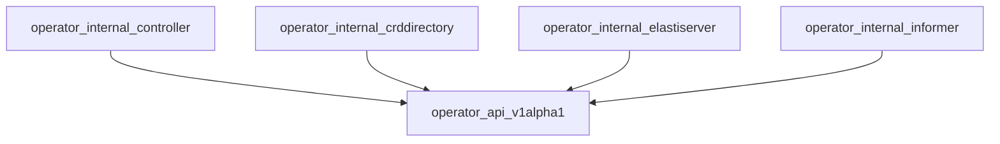

# operator_api_v1alpha1 Module Documentation

## Introduction

The `operator_api_v1alpha1` module defines the Custom Resource Definitions (CRDs) for the `ElastiService` resource within the operator. This module provides the Go types that represent the desired state (`Spec`) and observed state (`Status`) of an `ElastiService` instance, as well as auxiliary types like `ScaleTargetRef`, `ScaleTrigger`, and `AutoscalerSpec`. These definitions are crucial for Kubernetes API interactions, allowing users to declare and manage scalable services.

## Architecture Overview

The `operator_api_v1alpha1` module serves as the foundational API layer for the ElastiService operator. It defines the structure of the `ElastiService` custom resource, which is then utilized by other internal operator components for reconciliation, status updates, and management.

## Core Functionality

This module primarily defines the Go structs that map to the Kubernetes `ElastiService` Custom Resource. These types are used by the Kubernetes API server for validation and persistence, and by the operator's control plane to read and manipulate `ElastiService` objects.

### Core Components

#### `ElastiService`

The `ElastiService` struct is the top-level definition of the custom resource. It includes standard Kubernetes object metadata and embeds `ElastiServiceSpec` and `ElastiServiceStatus`.

*   **`metav1.TypeMeta`**: Contains API version and kind information.
*   **`metav1.ObjectMeta`**: Contains standard Kubernetes object metadata like name, namespace, labels, and annotations.
*   **`Spec ElastiServiceSpec`**: Defines the desired state of the ElastiService.
*   **`Status ElastiServiceStatus`**: Represents the observed state and conditions of the ElastiService.

#### `ElastiServiceSpec`

The `ElastiServiceSpec` defines the desired configuration for an `ElastiService`. It specifies how the target resource should be scaled, including minimum replicas, cooldown periods, and scaling triggers.

*   **`ScaleTargetRef`**: (Type: [ScaleTargetRef](#scaletargetref)) References the Kubernetes resource (e.g., Deployment, Rollout) that this ElastiService will manage and scale.
*   **`Service string`**: The name of the Kubernetes service associated with the target resource.
*   **`MinTargetReplicas int32`**: The minimum number of replicas the target resource should scale to (default: 1).
*   **`CooldownPeriod int32`**: The duration in seconds a target resource can be idle before being scaled down (default: 900 seconds, range: 0-604800).
*   **`Triggers []ScaleTrigger`**: (Type: [ScaleTrigger](#scaletrigger)) A list of conditions that trigger scaling actions. At least one trigger is required.
*   **`Autoscaler *AutoscalerSpec`**: (Type: [AutoscalerSpec](#autoscalerspec)) Optional specification for the autoscaler to be used (e.g., HPA, KEDA).

#### `ElastiServiceStatus`

The `ElastiServiceStatus` represents the observed state of the `ElastiService` resource. It provides information about the last reconciliation, scaling events, and the current operational mode.

*   **`LastReconciledTime metav1.Time`**: The last time the ElastiService was successfully reconciled.
*   **`LastScaledUpTime *metav1.Time`**: The last time the ElastiService's target resource was scaled up.
*   **`Mode string`**: The current operational mode of the ElastiService, either "proxy" (scaled to 0 replicas) or "serve" (scaled to at least 1 replica).

#### `ScaleTargetRef`

The `ScaleTargetRef` defines the reference to the Kubernetes resource that the `ElastiService` will control and scale.

*   **`APIVersion string`**: The API version of the target resource (e.g., `apps/v1`, `argoproj.io/v1alpha1`).
*   **`Kind string`**: The kind of the target resource (e.g., `Deployment`, `StatefulSet`, `Rollout`).
*   **`Name string`**: The name of the target resource.

#### `ScaleTrigger`

The `ScaleTrigger` defines a condition that can initiate a scaling action for the target resource. Currently, only `prometheus` type triggers are supported.

*   **`Type string`**: The type of the scaling trigger (e.g., `prometheus`).
*   **`Metadata json.RawMessage`**: A flexible field containing trigger-specific metadata, such as Prometheus query, server address, threshold, uptime filter, etc.

#### `AutoscalerSpec`

The `AutoscalerSpec` specifies the type and name of the autoscaler to be used with the `ElastiService`.

*   **`Type string`**: The type of autoscaler (e.g., `hpa`, `keda`).
*   **`Name string`**: The name of the autoscaler instance.

#### `ElastiServiceList`

`ElastiServiceList` is a standard Kubernetes list type for `ElastiService` resources, used when retrieving multiple `ElastiService` objects from the API.

*   **`metav1.TypeMeta`**: Contains API version and kind information.
*   **`metav1.ListMeta`**: Contains standard Kubernetes list metadata.
*   **`Items []ElastiService`**: A slice of `ElastiService` objects.
