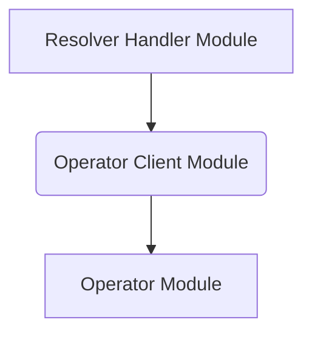

# Operator Client Module

## Introduction

The `operator_client` module, located at `resolver/internal/operator`, is responsible for facilitating communication between the `resolver` and the `operator` services. It acts as an RPC client, sending requests and information to the `operator` module, which manages scaling and resource allocation.

## Core Functionality

At the heart of the `operator_client` module is the `Client` component. This component is designed to establish and manage connections with the `operator` service, ensuring reliable delivery of operational data, such as incoming request information.

### `resolver.internal.operator.RPCClient.Client`

```go
type Client struct {
	logger *zap.Logger
	// retryDuration is the duration to wait before retrying the operator
	retryDuration time.Duration
	// serviceRPCLocks is to keep track of the locks for different services
	serviceRPCLocks sync.Map
	// operatorURL is the URL of the operator
	operatorURL string
	// incomingRequestEndpoint is the endpoint to send information about the incoming request
	incomingRequestEndpoint string
	// client is the http client
	client http.Client
}
```

**Purpose:**
The `Client` struct encapsulates all the necessary components for interacting with the `operator` service via HTTP. It manages the connection, retry logic, and synchronization for sending requests.

**Fields:**
*   `logger`: An instance of `zap.Logger` for structured logging within the client operations.
*   `retryDuration`: Specifies the duration to wait before retrying a failed request to the `operator`.
*   `serviceRPCLocks`: A `sync.Map` used to manage locks on a per-service basis, ensuring thread-safe operations when communicating with the `operator` for different services.
*   `operatorURL`: The base URL of the `operator` service, to which requests are directed.
*   `incomingRequestEndpoint`: The specific endpoint on the `operator` service where information about incoming requests is sent.
*   `client`: An `http.Client` instance used to make actual HTTP requests to the `operator`.

## Architecture and Component Relationships

The `operator_client` module serves as a critical bridge within the `resolver` system, enabling it to offload operational decisions and scaling commands to the `operator`. It primarily interacts with the `handler` module within the `resolver` and communicates directly with the `operator`'s server components.



### Relationship Details:

*   **Resolver Handler Module (`handler.md`)**: The `handler` module is responsible for processing incoming requests and, as part of its workflow, it utilizes the `operator_client` to communicate with the `operator`. This communication typically involves sending data about the incoming requests, which the `operator` can then use for scaling decisions or other operational tasks.
*   **Operator Module (`operator.md`)**: The `operator_client` module establishes an RPC connection with the `operator` module, specifically targeting its server components (e.g., `operator.internal.elastiserver.elastiServer.Server`). It sends various operational messages and request statistics, allowing the `operator` to maintain an up-to-date view of the system load and make informed scaling and resource management decisions.

## How the Module Fits into the Overall System

The `operator_client` module is an integral part of the `resolver`'s operational flow. The `resolver` is designed to handle and distribute requests efficiently. To achieve this, it needs to be aware of the overall system capacity and dynamic scaling capabilities provided by the `operator`.

By sending real-time request metrics and other relevant data, the `operator_client` ensures that the `operator` has the necessary information to: 
1. Adjust the number of running instances for various services.
2. Implement throttling mechanisms.
3. Proactively manage resources based on demand.

This separation of concerns allows the `resolver` to focus on request routing and initial processing, while delegating the complex task of resource orchestration and scaling to the dedicated `operator` module. The `operator_client` facilitates this crucial hand-off, making the entire system more scalable, resilient, and responsive to varying loads.
