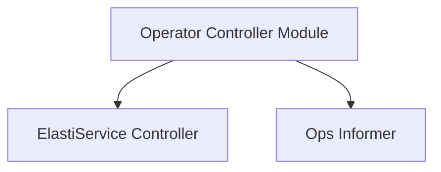

# Operator Controller Module

## Introduction
The `operator_controller` module is a crucial component within the `operator` system, responsible for orchestrating and managing the lifecycle of `ElastiService` custom resources. It acts as the brain of the operator, observing changes in the Kubernetes cluster and reacting to them to ensure the desired state of `ElastiService` instances.

## Purpose
The primary purpose of this module is to reconcile `ElastiService` objects, manage their scaling behavior, and interact with various internal and external components (like informers and scaling handlers) to maintain the stability and elasticity of services defined by `ElastiService` custom resources.

## Architecture Overview
The `operator_controller` module is composed of several key sub-modules that work in conjunction to achieve its reconciliation goals. The main components are the `ElastiServiceReconciler` and the `ops_informer` utilities, which handle the core logic for processing `ElastiService` events and managing object information, respectively.

## Sub-modules

### [ElastiService Controller](elastiservice_controller.md)
This sub-module contains the core reconciliation logic for `ElastiService` objects. It is responsible for observing `ElastiService` resources, determining their current state, and taking actions to bring them to their desired state. This includes tasks like managing scaling, interacting with the Kubernetes API, and handling various events related to `ElastiService`.

### [Ops Informer](ops_informer.md)
This sub-module provides utilities for managing and updating object information within the controller. It assists in tracking the state of Kubernetes objects relevant to the `ElastiService` reconciliation process, such as replica counts and selectors.
