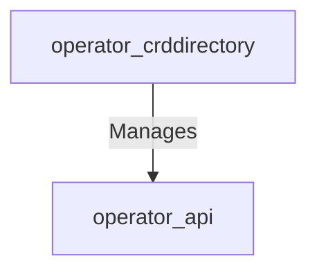

# operator_crddirectory Module Documentation

## Introduction

The `operator_crddirectory` module is a core component within the operator's internal infrastructure, responsible for managing and maintaining a directory of Custom Resource Definitions (CRDs). Specifically, it tracks `ElastiService` CRDs, storing their specifications and statuses. This module provides a centralized mechanism for the operator to access and manage information about the deployed `ElastiService` instances.

## Architecture Overview

The `operator_crddirectory` module primarily interacts with the `operator_api` module to retrieve and store CRD-related information. It provides a structured way to keep track of `ElastiService` definitions.



## Core Functionality

This module encapsulates two key components:

### CRDDetails

The `CRDDetails` struct (`operator.internal.crddirectory.directory.CRDDetails`) defines the structure for holding detailed information about an `ElastiService` Custom Resource Definition. It includes the CRD's name, its specification, and its current status.

```go
type CRDDetails struct {
	CRDName string
	Spec    v1alpha1.ElastiServiceSpec
	Status  v1alpha1.ElastiServiceStatus
}
```

- **`CRDName`**: A string representing the name of the Custom Resource Definition.
- **`Spec`**: An instance of `v1alpha1.ElastiServiceSpec` from the `operator_api` module, detailing the desired state of the `ElastiService`.
- **`Status`**: An instance of `v1alpha1.ElastiServiceStatus` from the `operator_api` module, reflecting the current operational status of the `ElastiService`.

### Directory

The `Directory` struct (`operator.internal.crddirectory.directory.Directory`) acts as a central repository for all `ElastiService` CRD details. It uses a `sync.Map` to safely store and retrieve `CRDDetails` instances across multiple goroutines, and includes a logger for operational insights.

```go
type Directory struct {
	Services sync.Map
	Logger   *zap.Logger
}
```

- **`Services`**: A `sync.Map` that stores `CRDDetails` objects, keyed by their `CRDName`. This provides a concurrent-safe way to manage the collection of `ElastiService` CRD details.
- **`Logger`**: A `zap.Logger` instance used for logging events and information related to the directory operations.
