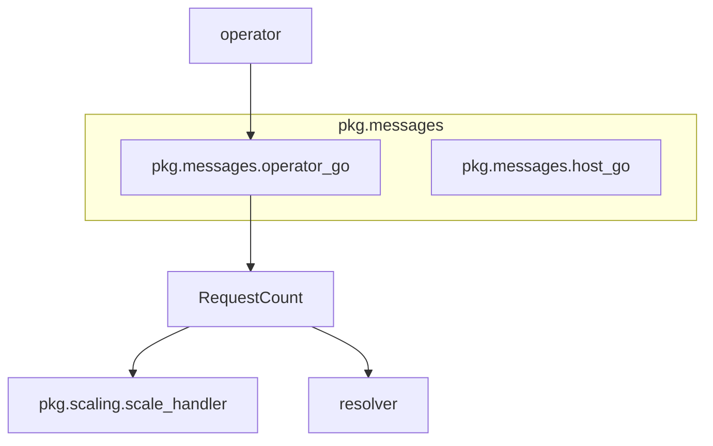

# pkg.messages.operator_go Module Documentation

## Introduction

The `pkg.messages.operator_go` module defines data structures used for communication within the system, specifically focusing on conveying request count information. Its primary component, `RequestCount`, serves as a standardized message format for reporting the number of requests associated with a particular service and namespace.

## Core Functionality: `RequestCount`

The `RequestCount` struct is a fundamental message type within the system, designed to encapsulate and transmit request metrics. It provides a clear and consistent way to communicate how many requests a specific service in a given namespace has processed or is currently handling.

### Structure of `RequestCount`

```go
type RequestCount struct {
	Count     int    `json:"count"`
	Svc       string `json:"svc"`
	Namespace string `json:"namespace"`
}
```

*   **`Count` (int):** Represents the numerical total of requests. This field is crucial for monitoring, autoscaling decisions, and general system observability.
*   **`Svc` (string):** Specifies the name of the service to which the request count pertains. This allows for granular tracking of requests per individual service.
*   **`Namespace` (string):** Indicates the Kubernetes namespace where the service resides. This provides the necessary context for identifying the service within a multi-tenant or complex Kubernetes environment.

## Architecture and Component Relationships

The `pkg.messages.operator_go` module, through its `RequestCount` message, acts as a communication bridge, enabling different parts of the system to exchange vital request metric data. It is typically produced by components responsible for observing service traffic (e.g., within the `operator` module) and consumed by modules that make decisions based on these metrics (e.g., `pkg.scaling.scale_handler` or `resolver`).



### How `RequestCount` Fits into the Overall System

The `RequestCount` message is integral to the system's ability to react dynamically to workload changes. For instance:

*   **Monitoring and Reporting:** The `operator` module or other monitoring agents might generate `RequestCount` messages to report current service load.
*   **Autoscaling:** The `pkg.scaling.scale_handler` module likely consumes `RequestCount` messages to determine if a service needs to be scaled up or down based on predefined thresholds and scaling policies.
*   **Request Routing/Load Balancing:** The `resolver` module might utilize `RequestCount` information to make intelligent decisions about routing incoming requests, potentially considering the current load reported for various services.

By providing a standardized and lightweight data structure, `RequestCount` facilitates efficient and reliable communication of critical operational data across the system components.
