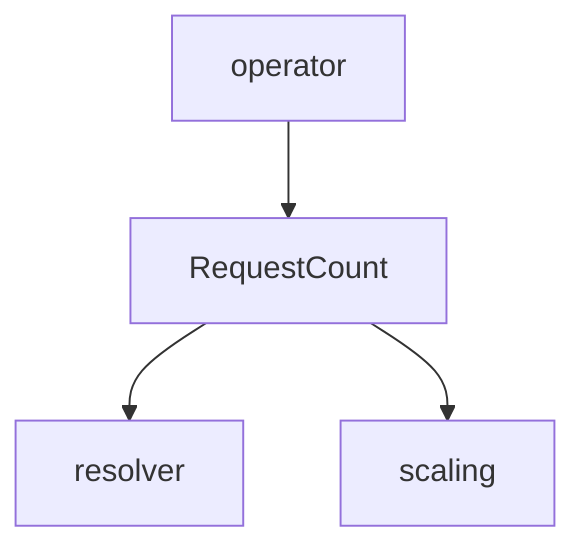

# operator_go Module Documentation

## Introduction

The `operator_go` module, specifically through its `RequestCount` component, defines the standard data structure for communicating request count metrics for services within the system. This module is part of the `pkg.messages` package and plays a crucial role in enabling various components to exchange information related to service demand and performance.

## Core Functionality

The primary function of this module is to provide the `RequestCount` struct, which encapsulates the following information:

*   **Count**: The number of requests.
*   **Svc**: The name of the service.
*   **Namespace**: The Kubernetes namespace where the service resides.

This standardized format facilitates reliable data exchange between different parts of the system, particularly those involved in monitoring, autoscaling, and operational control.

## Architecture and Component Relationships

The `operator_go` module, represented by the `RequestCount` data structure, serves as a communication primitive. It is primarily used by components that need to report or consume service request metrics. Key modules that interact with or utilize the `RequestCount` structure include:

*   **operator**: The main operator module likely generates or processes `RequestCount` messages for its operational logic.
*   **resolver**: The resolver module may consume `RequestCount` information to make routing or load balancing decisions.
*   **scaling**: The scaling module (e.g., `pkg.scaling.scale_handler`) would use `RequestCount` data to determine when to scale services up or down.

## How it Fits into the Overall System

The `operator_go` module's `RequestCount` struct is a fundamental building block for inter-module communication concerning service performance. It provides a lightweight and consistent way to convey essential metrics across the system's distributed components. This enables the system to react dynamically to changes in service load, facilitate intelligent routing, and ensure efficient resource utilization through effective scaling strategies. By standardizing this message format, the module contributes to the overall robustness and observability of the system.
