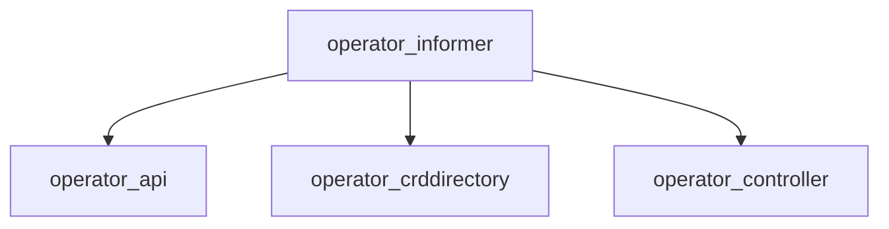

# operator_informer Module Documentation

## Introduction
The `operator_informer` module is a critical component within the operator system, primarily responsible for establishing and managing Kubernetes informers. These informers watch for changes to specified Kubernetes resources (Custom Resources and built-in types) and notify registered handlers when events such as creation, updates, or deletions occur. This reactive capability is fundamental for the operator to maintain desired states and respond to changes in the cluster.

## Architecture Overview
The `operator_informer` module integrates with other key modules to achieve its functionality. It relies on the `operator_api` module for defining the types of resources it watches and interacts with the `operator_crddirectory` to understand the Custom Resource Definitions (CRDs) available in the cluster. Changes detected by the informers are typically processed by components within the `operator_controller` module.



## Core Functionality

### RequestWatch
The `RequestWatch` component (`operator.internal.informer.informer.RequestWatch`) defines the parameters for an informer to watch a specific Kubernetes resource. It encapsulates all necessary information, including the request object from the controller, resource name, namespace, GroupVersionResource (GVR), and the event handlers that will process resource changes. This structure is essential for dynamically configuring informers to monitor various resource types.

```go
type (
	// Manager helps manage lifecycle of informer
	Manager struct {
		client              *kubernetes.Clientset
		dynamicClient       *dynamic.DynamicClient
		logger              *zap.Logger
		informers           sync.Map
		resolver            info
		resyncPeriod        time.Duration
		healthCheckDuration time.Duration
		healthCheckStopChan chan struct{}
	}

	info struct {
		Informer cache.SharedInformer
		StopCh   chan struct{}
		Req      *RequestWatch
	}

	// RequestWatch is the request body sent to the informer
	RequestWatch struct {
		Req                  ctrl.Request
		ResourceName         string
		ResourceNamespace    string
		GroupVersionResource *schema.GroupVersionResource
		Handlers             cache.ResourceEventHandlerFuncs
	}
)
```

### KeyParams
The `KeyParams` component (`operator.internal.informer.informer.KeyParams`) provides a structured way to identify a specific Kubernetes resource. It includes the resource's namespace, CRD name (if applicable), resource type, and resource name. This structure is crucial for uniquely identifying and retrieving resource objects within the informer's cache or when performing operations on specific instances.

```go
type KeyParams struct {
	Namespace    string
	CRDName      string
	ResourceType string
	ResourceName string
}
```
