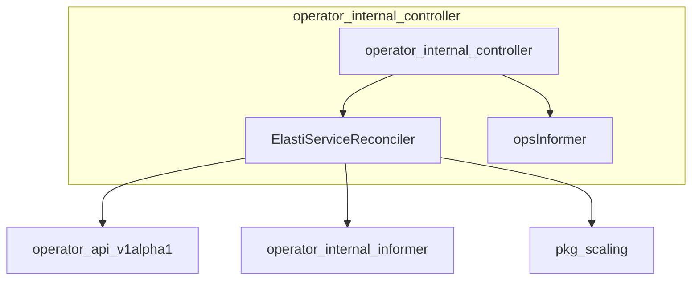

# operator_internal_controller Module Documentation

## Introduction

The `operator_internal_controller` module is a core component within the operator, responsible for orchestrating the reconciliation and management of `ElastiService` custom resources. It acts as the central control plane, ensuring that the desired state of `ElastiService` objects, as defined by users, is consistently maintained in the Kubernetes cluster. This module interacts with various other operator components, including API definitions, informers, and scaling handlers, to provide a robust and responsive control loop.

## Architecture Overview

The `operator_internal_controller` module integrates with several other modules to perform its reconciliation tasks. It primarily consists of the `ElastiServiceReconciler`, which is responsible for the main control loop, and helper components like `opsInformer` which process object updates.

## High-Level Functionality

The `operator_internal_controller` module provides the following high-level functionalities:

*   **`ElastiServiceReconciler`**: This is the heart of the controller, implementing the Kubernetes reconciliation loop for `ElastiService` resources. It observes changes to `ElastiService` objects and takes appropriate actions to align the cluster state with the desired state defined in the CRD. This includes managing associated deployments, services, and other Kubernetes resources, as well as interacting with the scaling logic.
*   **`opsInformer`**: This component handles updates related to Kubernetes objects, providing the `ElastiServiceReconciler` with the necessary information to make informed decisions during the reconciliation process. It specifically uses the `updateObjInfo` struct to encapsulate relevant object details for processing.

For detailed information on the `ElastiService` custom resource definition, refer to the [operator_api_v1alpha1.md](operator_api_v1alpha1.md) documentation.
For details on how informers work and their management, see the [operator_internal_informer.md](operator_internal_informer.md) documentation.
For information regarding the scaling mechanisms, refer to the [pkg.md](pkg.md) documentation.
