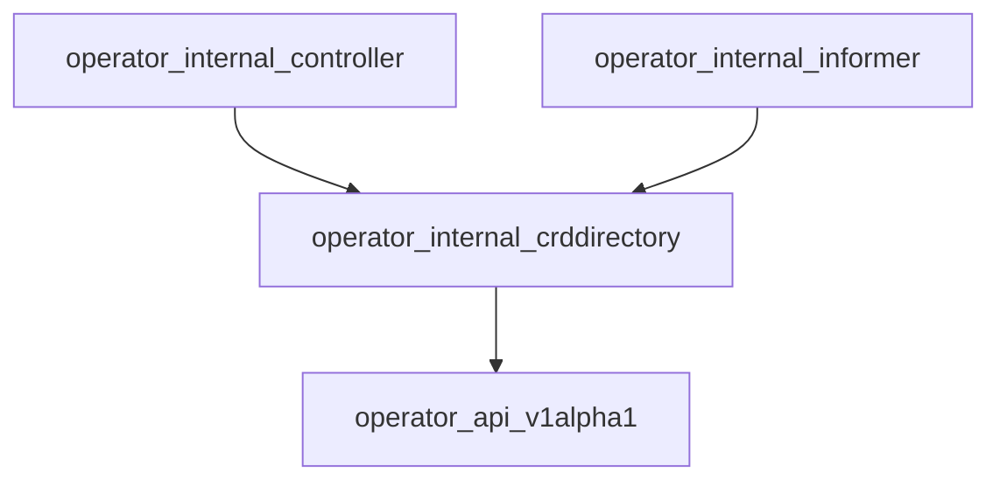

# operator_internal_crddirectory Module Documentation

## Introduction
The `operator_internal_crddirectory` module is a crucial component within the operator, responsible for maintaining an in-memory directory of Custom Resource Definitions (CRDs), specifically instances of `ElastiService`. It provides a centralized and efficient way to store, retrieve, and manage the specifications and statuses of these services, which are critical for the operator's reconciliation and scaling logic.

## Architecture Overview
This module acts as a registry for `ElastiService` CRDs. It holds essential information about each service, allowing other parts of the operator, such as the controllers, to quickly access and process CRD details without repeatedly querying the Kubernetes API server for every operation. It primarily interacts with the `operator_api_v1alpha1` module to understand the structure of `ElastiService` CRDs and is utilized by modules like `operator_internal_controller` to manage the lifecycle of these services.

## High-Level Functionality

The `operator_internal_crddirectory` module provides two core components: `Directory` and `CRDDetails`.

### Directory
The `Directory` component serves as the central repository for all `ElastiService` CRD information managed by the operator. It uses a concurrent map to ensure thread-safe access to service details across different goroutines.

*   **Purpose:** To store and provide efficient lookup of `ElastiService` CRD details.
*   **Core Components:**
    *   `Services` (`sync.Map`): A thread-safe map that stores `CRDDetails` objects, keyed by the CRD name. This allows for quick retrieval and update of service information.
    *   `Logger` (`*zap.Logger`): An instance of a Zap logger for logging operational events and errors within the directory.
*   **Relationships:**
    *   Likely populated and updated by components within `operator_internal_informer` which watches for changes in `ElastiService` CRDs.
    *   Accessed by `operator_internal_controller` (e.g., `ElastiServiceReconciler`) to retrieve current service states and specifications for reconciliation logic.

### CRDDetails
The `CRDDetails` component encapsulates the specific details of a single `ElastiService` CRD. It provides a structured way to hold the name, desired specification, and current status of an `ElastiService` instance.

*   **Purpose:** To represent the detailed information of an `ElastiService` Custom Resource.
*   **Core Components:**
    *   `CRDName` (`string`): The name of the `ElastiService` custom resource.
    *   `Spec` (`v1alpha1.ElastiServiceSpec`): The desired state and configuration of the `ElastiService`, as defined in its `spec` field. For more details, refer to the [operator_api_v1alpha1.md](operator_api_v1alpha1.md) documentation.
    *   `Status` (`v1alpha1.ElastiServiceStatus`): The current observed state and status of the `ElastiService`, as reported in its `status` field. For more details, refer to the [operator_api_v1alpha1.md](operator_api_v1alpha1.md) documentation.
*   **Relationships:**
    *   Directly references data types defined in the [operator_api_v1alpha1.md](operator_api_v1alpha1.md) module for its `Spec` and `Status` fields, ensuring consistency with the CRD API definition.
    *   These details are managed within the `Directory` by other modules like the `operator_internal_controller` and `operator_internal_informer`.
