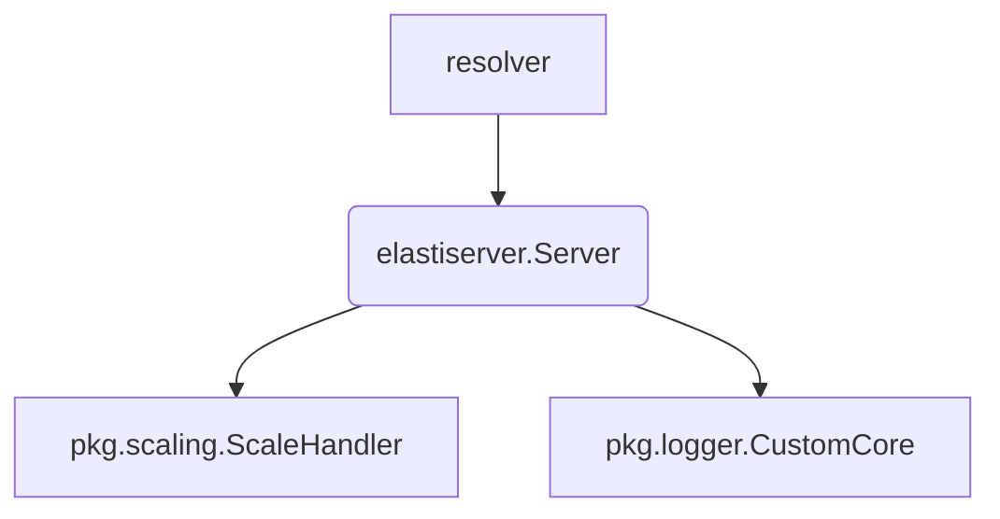

# operator.internal.elastiserver Module Documentation

## Introduction

The `operator.internal.elastiserver` module is a core component within the `operator` responsible for handling external communications, primarily from the `resolver` module, to initiate scaling actions for services. It acts as an event listener, detecting requests for services and triggering necessary scale-up operations, especially when a service is at zero replicas.

## Core Functionality

The primary component within this module is the `Server` struct, which encapsulates the logic for receiving external communication and orchestrating scaling through a `ScaleHandler`.

### `Server` Component

```go
type (
	Response struct {
		Message string `json:"message"`
	}

	// Server is used to receive communication from Resolver, or any future components
	// It is used by components about certain events, like when resolver receive the request
	// for a service, that service is scaled up if it's at 0 replicas
	Server struct {
		logger       *zap.Logger
		scaleHandler *scaling.ScaleHandler
		// rescaleDuration is the duration to wait before checking to rescaling the target
		rescaleDuration time.Duration
	}
)
```

*   **Purpose**: The `Server` component is designed to be the entry point for external systems (like the `resolver`) to communicate events that require the `operator` to take action, specifically scaling. When the `resolver` identifies a request for a service that is currently scaled down (e.g., to 0 replicas), it notifies the `Server`, which then initiates a scale-up operation.

*   **Fields**:
    *   `logger (*zap.Logger)`: An instance of a Zap logger for structured and efficient logging within the `Server` component. This helps in debugging and monitoring the server's operations.
    *   `scaleHandler (*scaling.ScaleHandler)`: A pointer to a `ScaleHandler` instance. This is a crucial dependency as it provides the functionality to perform the actual scaling operations on Kubernetes resources. For more details, refer to the [pkg_scaling_scale_handler](pkg_scaling_scale_handler.md) documentation.
    *   `rescaleDuration (time.Duration)`: This field defines the duration the `Server` waits before re-evaluating and potentially rescaling a target. It helps in preventing rapid, consecutive scaling operations and allows for a cool-down period.

## Architecture and Component Relationships

The `elastiserver` module, specifically the `Server` component, plays a central role in connecting external request-driven events with the internal scaling logic of the `operator`. It primarily interacts with the `resolver` module, which acts as the source of scaling triggers, and leverages components from the `pkg` module for logging and actual scaling execution.



## How it Fits into the Overall System

The `operator.internal.elastiserver` module serves as a critical bridge between the `resolver`'s request handling and the `operator`'s resource management capabilities. In a typical workflow:

1.  The `resolver` receives an incoming request for a particular service.
2.  If the service needs scaling (e.g., it's currently at zero replicas), the `resolver` communicates this event to the `elastiserver.Server`.
3.  The `Server` then utilizes its `ScaleHandler` to interact with the Kubernetes API and adjust the replica count of the target service.
4.  This mechanism ensures that services are dynamically scaled up in response to demand, providing an efficient autoscaling solution.

This module is essential for the `operator`'s ability to react to real-time demand signals and maintain optimal resource utilization.