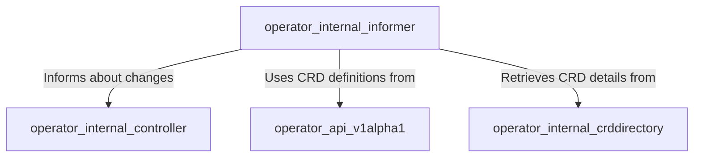

# Operator Internal Informer Module

## Introduction

The `operator_internal_informer` module is a crucial component within the operator responsible for actively monitoring Kubernetes resources for changes. It acts as an event listener, detecting creations, updates, and deletions of specified custom resources (CRDs) and standard Kubernetes resources. Upon detecting a change, it dispatches events to other modules, primarily the `operator_internal_controller`, to trigger reconciliation processes.

This module is essential for maintaining the desired state of resources managed by the operator, ensuring that any modifications or new deployments are promptly handled.

## Architecture Overview

The `operator_internal_informer` module relies on Kubernetes informers to watch for resource changes. It leverages shared informers to efficiently distribute event notifications across different parts of the operator, reducing the load on the Kubernetes API server.



## Core Components

The `operator_internal_informer` module is composed of the following core components:

### RequestWatch

The `RequestWatch` struct defines the parameters for a watch request sent to the informer. It encapsulates all necessary information for the informer to set up a watch on a specific Kubernetes resource.

**Code:**
```go
type (
	// Manager helps manage lifecycle of informer
	Manager struct {
		client              *kubernetes.Clientset
		dynamicClient       *dynamic.DynamicClient
		logger              *zap.Logger
		informers           sync.Map
		resolver            info
		resyncPeriod        time.Duration
		healthCheckDuration time.Duration
		healthCheckStopChan chan struct{}
	}

	info struct {
		Informer cache.SharedInformer
		StopCh   chan struct{}
		Req      *RequestWatch
	}

	// RequestWatch is the request body sent to the informer
	RequestWatch struct {
		Req                  ctrl.Request
		ResourceName         string
		ResourceNamespace    string
		GroupVersionResource *schema.GroupVersionResource
		Handlers             cache.ResourceEventHandlerFuncs
	}
)
```

**Responsibilities:**
- Specifies the Kubernetes resource to be watched (`ResourceName`, `ResourceNamespace`, `GroupVersionResource`).
- Provides handlers (`cache.ResourceEventHandlerFuncs`) to define the actions to be taken upon different events (add, update, delete) for the watched resource.
- Contains a `ctrl.Request` object, which is typically used by controllers to reconcile resources.

### KeyParams

The `KeyParams` struct is used to identify a specific resource uniquely within the informer's context.

**Code:**
```go
type KeyParams struct {
	Namespace    string
	CRDName      string
	ResourceType string
	ResourceName string
}
```

**Responsibilities:**
- Provides a composite key for identifying a watched resource.
- Facilitates efficient lookup and management of resources by their unique parameters.
- Used internally by the informer to track and manage watches.
