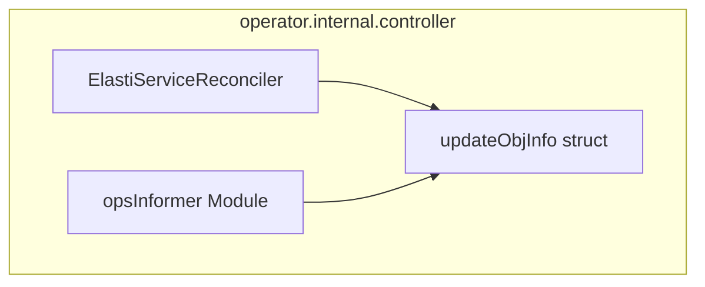

# opsInformer Module Documentation

## Introduction

The `opsInformer` module, located within `operator/internal/controller`, provides core data structures used by the Kubernetes operator's controller logic. Its primary component, `updateObjInfo`, is designed to encapsulate critical information about a Custom Resource Definition (CRD) object, particularly `ElastiService` resources, during the reconciliation process. This module facilitates the efficient transfer and handling of object-specific details required for the operator to manage and update its resources effectively.

## Core Components

### `updateObjInfo` Structure

The `updateObjInfo` struct is a fundamental data structure within the `opsInformer` module. It serves as a container for key information derived from an `ElastiService` Custom Resource, which is essential for the `ElastiServiceReconciler` to perform its reconciliation tasks.

**Definition:**

```go
type updateObjInfo struct {
	specReplicas   int64
	statusReplicas int64
	selector       map[string]interface{}
	namespace      string
	name           string
}
```

**Fields:**

*   **`specReplicas` (int64):** Represents the desired number of replicas as specified in the `spec` section of the `ElastiService` object. This value dictates the target scale for the managed workload.
*   **`statusReplicas` (int64):** Indicates the current number of replicas reported in the `status` section of the `ElastiService` object. This reflects the actual running instances of the workload.
*   **`selector` (map[string]interface{}):** A map of key-value pairs used to identify and select associated Kubernetes resources (e.g., Deployments, StatefulSets) managed by the `ElastiService`. It helps the operator to find and operate on the correct set of resources.
*   **`namespace` (string):** The Kubernetes namespace where the `ElastiService` object resides. This ensures operations are performed within the correct scope.
*   **`name` (string):** The name of the `ElastiService` object. This uniquely identifies the instance of the custom resource.

## Architecture and Component Relationships

The `opsInformer` module, through its `updateObjInfo` struct, plays a supporting role within the `operator.internal.controller` package. It primarily interacts with the `ElastiServiceReconciler` in the `elastiservice_controller` module, providing the necessary object state for reconciliation.



## How the Module Fits into the Overall System

The `opsInformer` module is an integral part of the `operator`'s control plane, specifically within the reconciliation loop of `ElastiService` resources. When an `ElastiService` object is created, updated, or deleted, the `ElastiServiceReconciler` (from the `elastiservice_controller` module) is triggered. During this process, information about the `ElastiService` is gathered and often stored or processed using the `updateObjInfo` structure.

This struct provides a convenient way to pass essential details—such as desired and current replicas, selectors for managed workloads, and object metadata (namespace and name)—between different functions and stages of the reconciliation. This ensures that the `ElastiServiceReconciler` has all the necessary context to:

1.  Determine the current state of the `ElastiService` and its managed resources.
2.  Calculate any discrepancies between the desired state (spec) and the actual state (status).
3.  Initiate scaling actions or other necessary updates to bring the system to the desired state.
4.  Update the `status` field of the `ElastiService` CRD to reflect the latest state.

By centralizing this information in `updateObjInfo`, the `opsInformer` module contributes to the clarity, maintainability, and efficiency of the `ElastiService` operator's core control logic.

For a deeper understanding of the `ElastiService` Custom Resource Definition and its types, refer to the [operator_api_v1alpha1.md](operator_api_v1alpha1.md) documentation.
